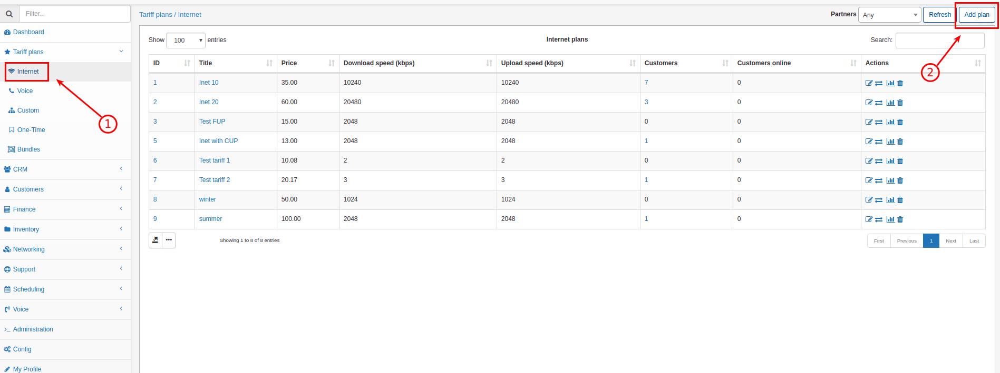
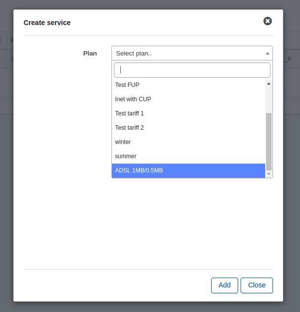
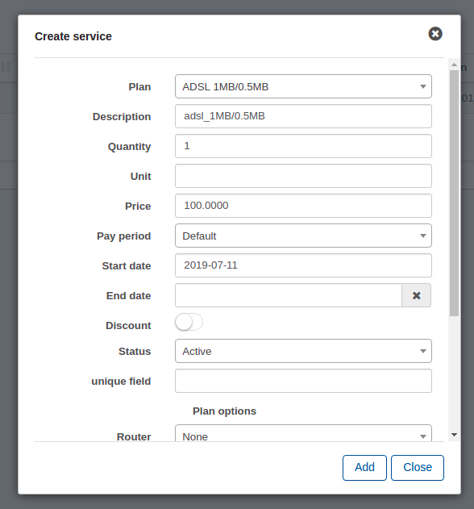

Internet plans
==============

To configure the Internet plan, click on the _Tariff plans → Internet_ and click on _Add plan._

You will redirect to add plan page and be possible to create a plan.

* Title - the name that describes the plan in the Internet plans table
* Service name - the service name will be used for description
* Price - the monthly price for the service
* Partners - the partner 's name
* VAT - the percentage of the VAT
* VAT Included - select if Price in plan is VAT included or excluded
* Download speed (Kbps) - the download speed for the internet plan
* Upload speed (Kbps) - the upload speed for the internet plan. Values of Download and Upload speed are **MIR** (Maximum Information Rate) – best case scenario, maximum available data rate for flow, if there is free any part of bandwidth.
* Guaranteed speed limit at - the percentage shows what speed we guarantee for the end user. It's **CIR** (Committed Information Rate) – worst case scenario, flow will get this amount of traffic rate regardless of other traffic flows. At any given time, the bandwidth should not fall below this committed rate.
* Priority - the options are: Low, Normal, High. IP packets of customers with High priority will be forwarded as first in case of congestion. Values are 1 (high), 4(normal) and 8(low).
* Aggregation - how many users will share the speed in plan
* Burst limit - the percentage of maximum allowed burst speed
* Burst threshold - the percentage that setups a value of burst on/off switch
* Burst Time - the period of time for calculation of Burst values
* Tariff plans available in customer portal - the list of tariffs allowed for changing from current tariff on customer's portal
* Types of billing - the types of billing for which allowed current tariff
* Prepaid (custom) period - by default it's monthly and customers will charges for whole month, but you can select "Days amount"
* _Custom period (days)_* - appears only when selected "Days amount" (from previous step) and allow to set custom pedion in days (7 days (week), 10 days, etc up to 365 days)

* Available when register by social network - using from social/self registration addon and allow to select current tariff during registration

It is possible to edit or to delete the tariff with the icons <icon class="image-icon"></icon> or <icon class="image-icon"></icon>in the column Actions.

On the left bottom of the table, there are two symbols <icon class="image-icon"></icon>. The first one on the left <icon class="image-icon"></icon> is used to copy, print the table and to export it in different formats: Excel, CSV, PDF. The second one <icon class="image-icon"></icon> is used to modify the view of the table.

After the creation of Internet plan, it is possible to associate service to the customer. Click on _Customer → List_, select the customer, click on the tab _Services_ and on the +.

A window will pop up to create the service.

It is possible to see the new service in the Services' table.

