CDR processing
==========

You can import a CDR(in .csv format) for charge the customer and print in his invoice the register of calls, messages or data.

Behind the processing menu there are 4 other pages, CDR Import, CDR Export, CDR History and CDR errors.
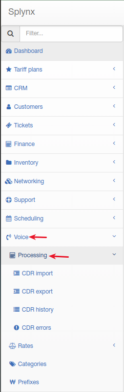

### Import CDR

To import a CDR file you have to upload this file(in .csv format), select delimiter, enable/disable first row contains column names, select voice type(call, messages, data or mixed) and select handler("Base" handler by default). Provider selection can be missed.

*NOTE! Almost every our client has different type of CDR files, so if Splynx base handler can't process your file because of another format you should ask Splynx Support to develop a custom handler for your type of CDR files. You should send 2-3 CDR files as an example and full description(what field should be imported, what field can be missed etc.). Handler development takes few business days and it's absolutely free*

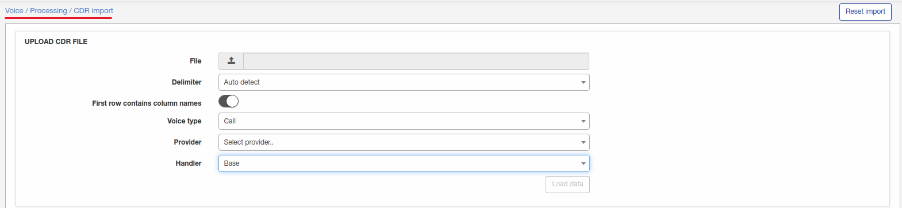

Let's import some CDR file with only calls in it.

I have a csv file with only 3 calls and very simple format:

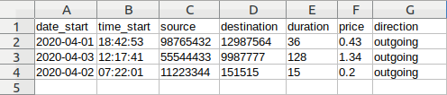

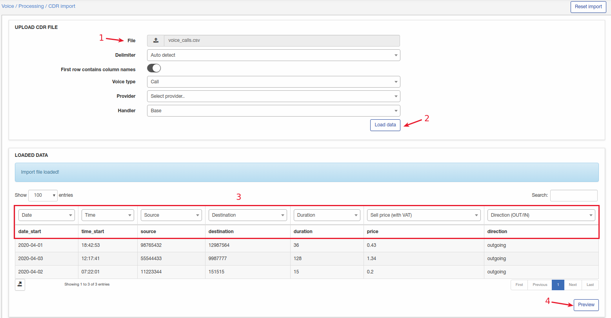

If you have messages or data records in a CDR, other appropriate columns should be selected.

*Regarding incoming calls. If your CDR file contains incoming calls, appropriate voice service must be created for a customer: with "direction" = incoming, and "phone number" = Destination number from a file(or pattern like 123{!} - means all phone number beginning with 123)*

Once it's load, selected the correct value in every column(step 3), and then click on preview(step 4) to check what we will get:

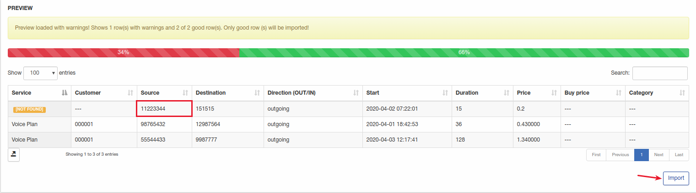

Preview shows 1 error because service not found. Next 2 calls were imported as customer has 2 voice services with appropriate phone numbers:

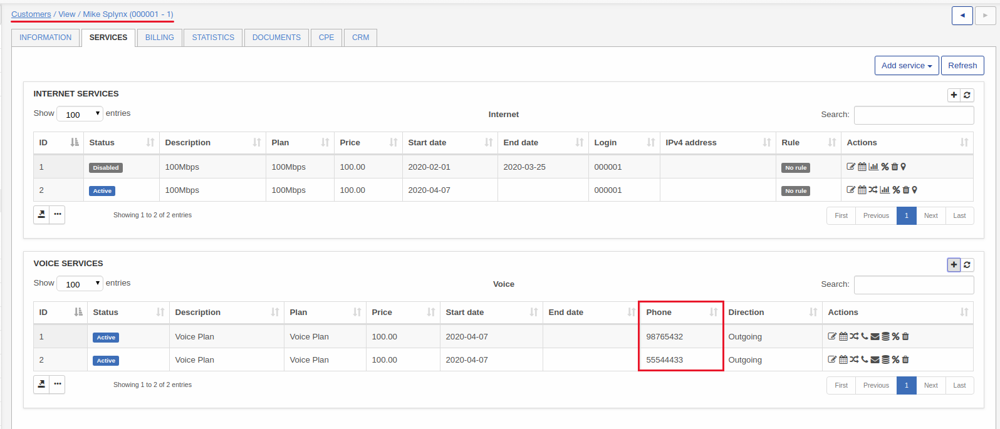

We will import 2 calls and reprocess an error later after fixing:
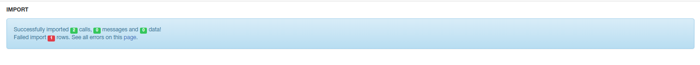

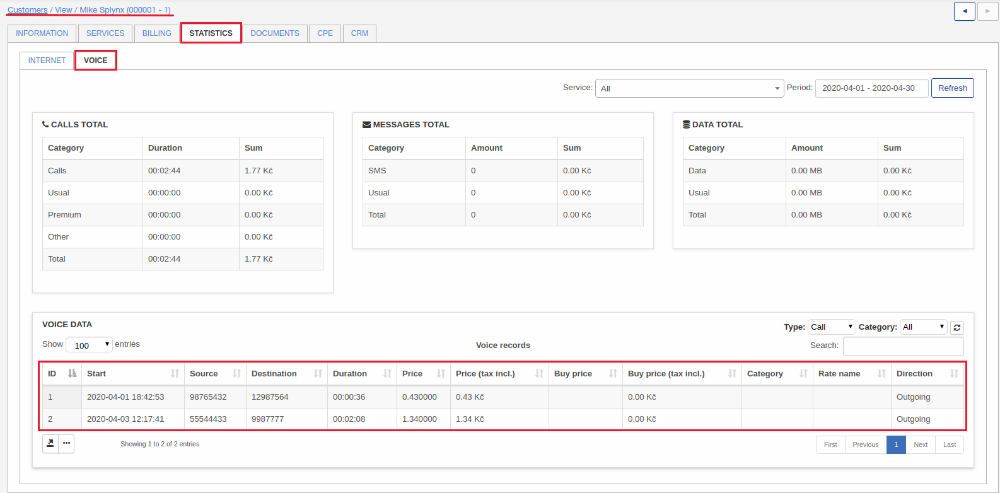

 Now let's check and fix CDR errors:

 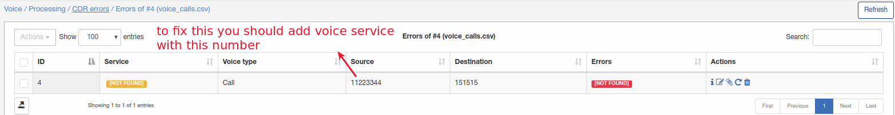

To show Splynx what customer has this phone number we have to create a voice service for a customer with "Source" number as "Phone number" of service:

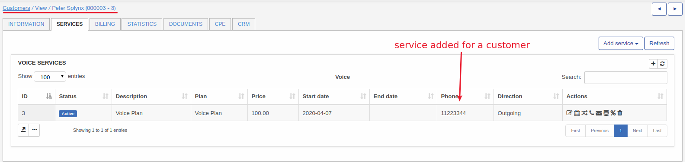

Now you can reprocess all errors:

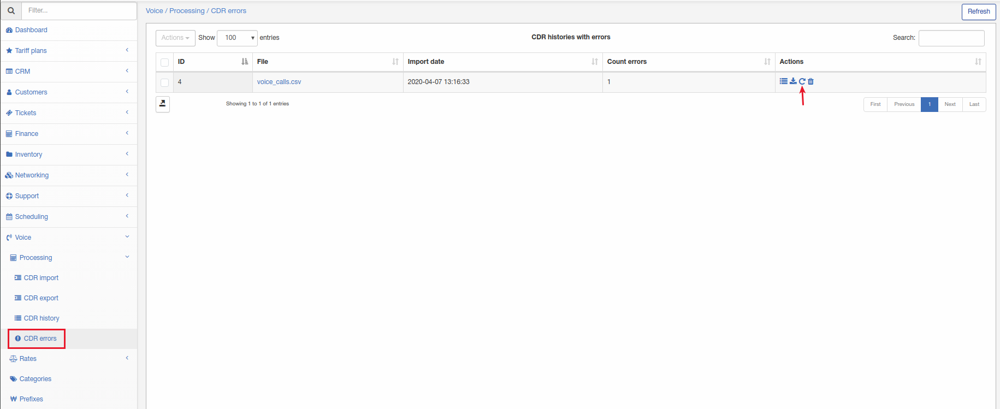

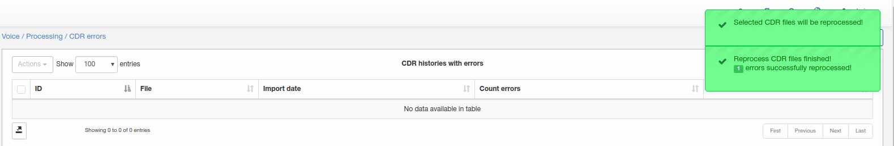

Now when an error was reprocessed you can check a customer:

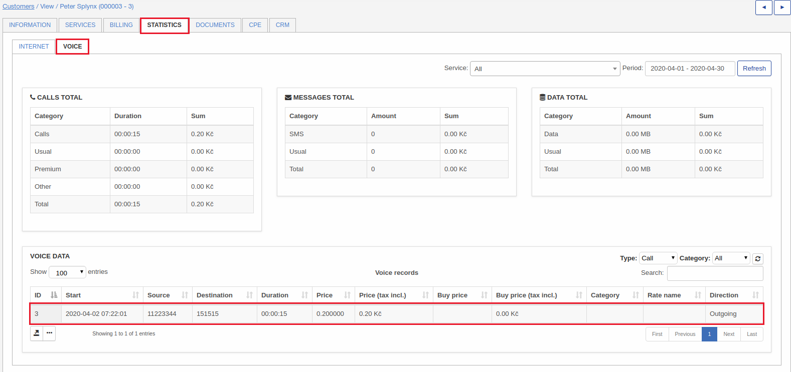

If you are using voice categories in Splynx, and you have category name for every call in a CDR file, this name should be changed to category ID(under Voice/Categories), name of a category can be detected and imported using custom handler(what we can develop for you).

### Export CDR

It's also possible to export the same data that we imported to Splynx to a new CDR, filtering by period and voice type.

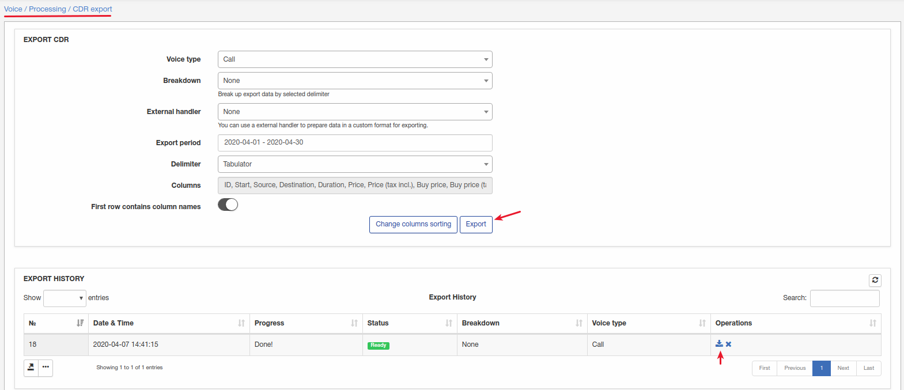

After generating you can download an archive with csv file with a calls.

### History CDR

In the history, we can check the register of CDR imported, download them or delete in case that something was wrong or missed. If some history record will be deleted all the information(calls,data,messages) what this record contained - will be also deleted.

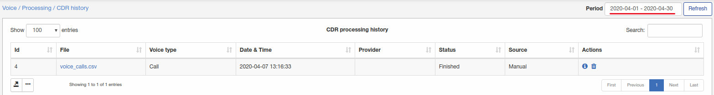

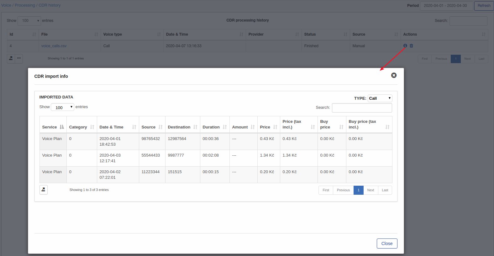
