Administrators can connect Splynx to their Google account to sync tasks assigned to them to their Google calendars.

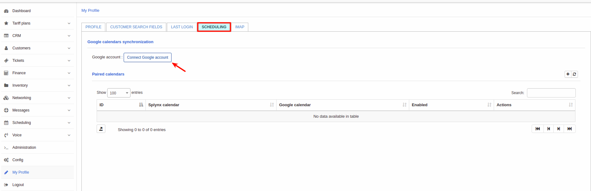

To connect a Google account, click on the **Connect Google account** button and follow the steps to connect the account.

Upon clicking on the Add Google account button, the following window will appear:

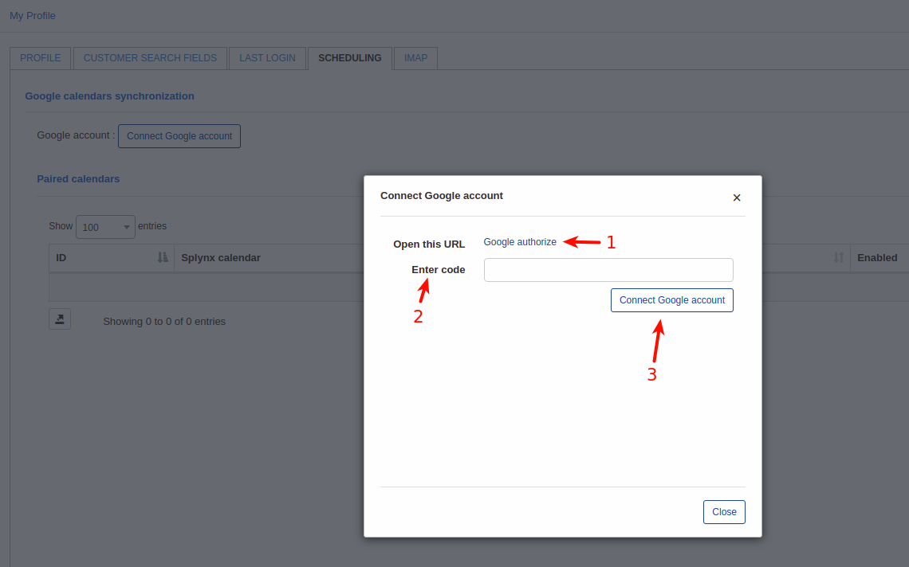

Click on the Google authorize link(1) to sign in. You will be redirected to the Google sign in page. Follow the instructions and allow using of Splynx calendar into a Google account.

You will then receive a code which you will enter into the field provided to connect the Google calendar in Splynx(2).

Simply copy this code and click on *connect Google account*(3) to complete the process:

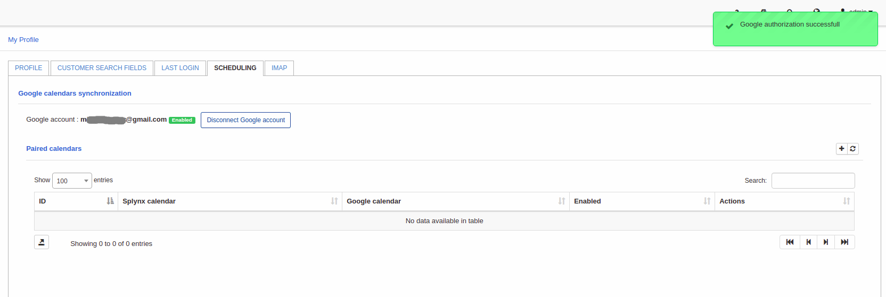

To sync Splynx tasks to the connected Google calendar, it is necessary to add a paired calendar. This allows the Splynx calendar of the administrator to sync items into the Google calendar. Simply click on the + add paired calendar button to add a paired calendar:

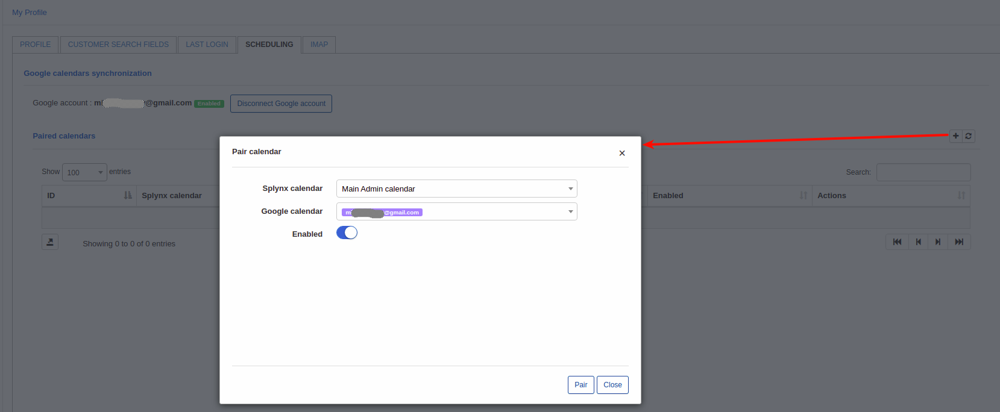

Once this done let's assign some task to this admin:

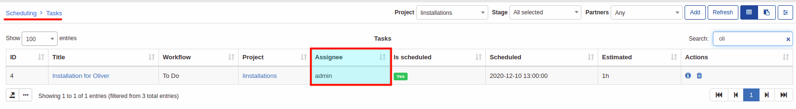

Now admin will be able to see this task directly in Google calendar:

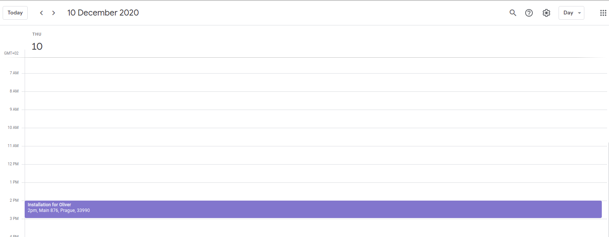

Let's imagine a scenario when you add a [scheduling team](../../configuration/scheduling/teams/teams.md) named "Technicians" where a current admin is a member of this team. You assigned a task to a team "Technicians":

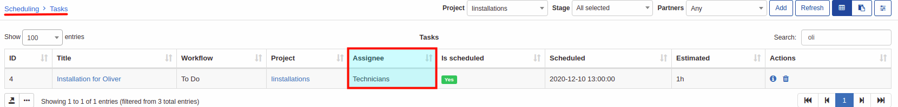

and even if admin is a member of a team, task wasn't synced to Google calendar:

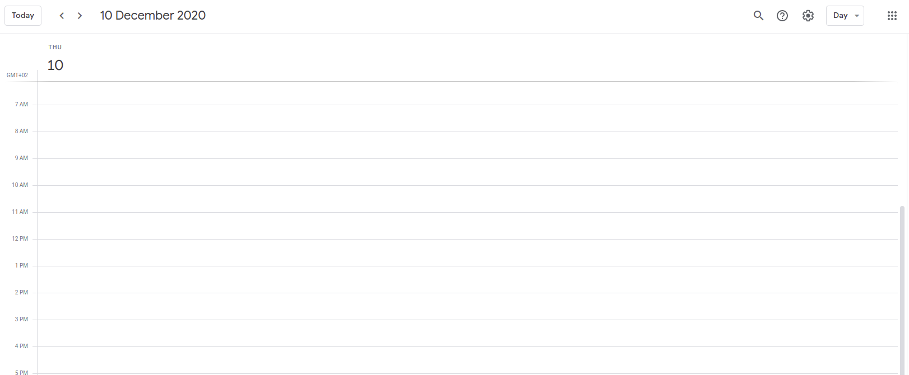

The reason of this - you didn't pair a calendar of this team. Let's do this:

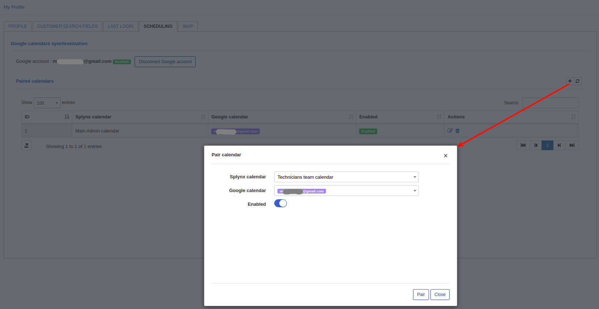

once  this done you can check your Google calendar:

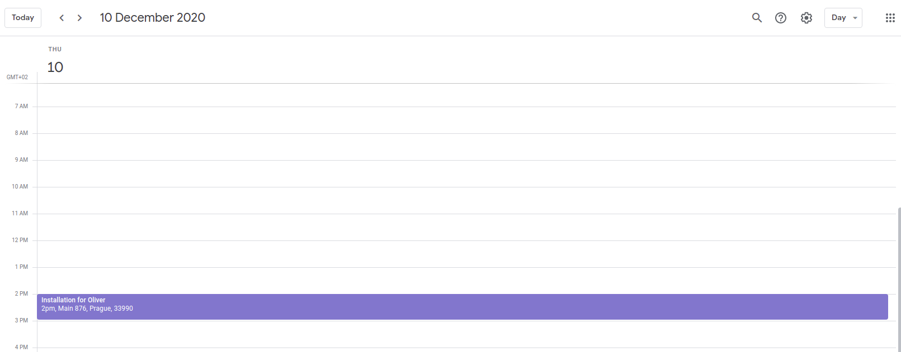

**Conclusion**: if admin wants to sync tasks what assigned directly to him and tasks what assigned to a team(where this admin is a member) it's needed to pair a personal calendar and a team calendar:

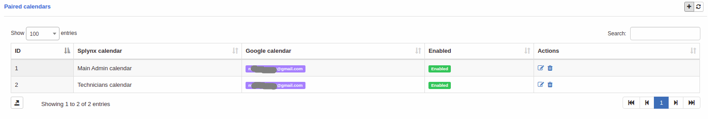

Note that if admin is a member of few teams, each calendar of this team needs to be paired here to sync tasks assigned to these teams. 
