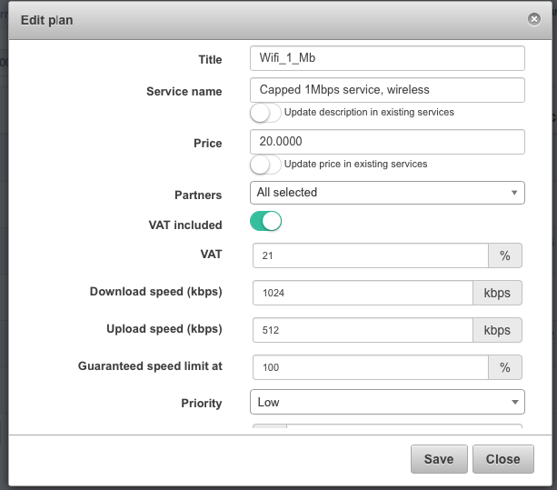
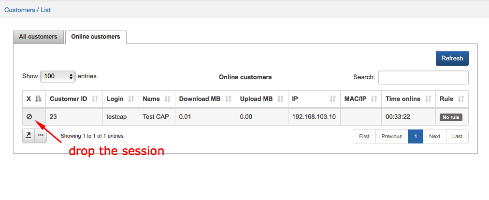

Cisco IOS XE : PPPoE Radius
==========

Cisco IOS and Cisco IOS XE differs in configuration. The main difference is that Cisco IOS uses rate-limit attributes for speed limitation. Cisco IOS XE doesn't have support of rate-limiting. Cisco IOS XE is used in ASR 1001, 1002, 1003 router series. If we want to limit speed of the PPPoE customers, we must follow these steps :

1. Configure Policies for each single plan that we have in our network
2. During PPPoE authentication Radius server must send an attribute with the policy name (tariff plan) where customer belongs.

The attribute syntax is :

```
Cisco-AVPair = ip:sub-qos-policy-out=PLAN-DOWNLOAD
Cisco-AVPair += ip:sub-qos-policy-in=PLAN-UPLOAD
```

---
Let's go though the whole config, starting with configuring Plans and Attributes for speed limitation in Splynx Radius server.

## Step 1.
Define the naming of our policy/plan attributes. The names are taken from Splynx Internet tariff Titles. We will setup the internet plan ``"Wifi_1_Mb"``.

Then the policy name in cisco will be `Wifi_1_Mb-down, Wifi_1_Mb-up`. Now we are going to add additional field "Policy" to tarrif plans in Splynx :




## Step 2.
Ok, we got the field policy name for each tariff plan. Check the settings of attribute in Splynx:


## Step 3.
If we will use Fair User Policy, we must configure also the FUP plan names. It must be without spaces, for example `Wifi_1_slow`, will slowdown user if he transfers over 100 MB per day :


## Step 4.
Configure the policies on Cisco IOS XE router :

```
policy-map Wifi_1_Mb-down
class class-default
police cir 1024000 bc 6000 be 6000 conform-action transmit exceed-action drop

policy-map Wifi_1_Mb-up
class class-default
police cir 512000 bc 6000 be 6000 conform-action transmit exceed-action drop
```

And the policy for FUP slowdown action Wifi_1_slow :
```
policy-map Wifi_1_slow-down
class class-default
police cir 512000 bc 6000 be 6000 conform-action transmit exceed-action drop

policy-map Wifi_1_slow-up
class class-default
police cir 256000 bc 6000 be 6000 conform-action transmit exceed-action drop
```

## Step 5.
Connect the customer and verify that the policy was applied to his virtual interface :
```
Cisco_IOS_XE#show pppoe session

     1 session  in LOCALLY_TERMINATED (PTA) State

     1 session  total


Uniq ID  PPPoE  RemMAC          Port                    VT  VA         State

           SID  LocMAC                                      VA-st      Type

    268    268  5001.0001.0002  Gi2                      1  Vi1.2      PTA  

                5001.0003.0001                              UP
```

The interface name is Virtual-access 1.2
```
Cisco_IOS_XE#show policy-map interface Virtual-access 1.2
```

the output of the command should be :
```
Cisco_IOS_XE#show policy-map interface Virtual-access 1.1

 Virtual-Access1.1

 SSS session identifier 282 -

  Service-policy input: Wifi_1_Mb-up

  Service-policy output: Wifi_1_Mb-down
```
with the details of traffic that was forwarded or limited by the policy


---
The full configuration of Cisco IOS XE router that was used in the LAB configuration :
```
service password-encryption

aaa new-model

!

!

aaa group server radius SPLYNX

 server name SPLYNX

 server X.X.X.X auth-port 1812 acc-port 1813


!         

aaa authentication ppp default group radius local

aaa authorization network default group radius

aaa accounting delay-start

aaa accounting exec default

 action-type start-stop

 group radius

!         

aaa accounting network default start-stop group radius

aaa accounting system default start-stop group radius

!               

!         

aaa server radius dynamic-author

 client 10.0.1.16 server-key 7 06575D72181B5F

 server-key 7 014254570F5E50

 port 3799

 auth-type any

 ignore session-key

 ignore server-key

!         

aaa session-id common

!

policy-map Wifi_1_Mb-down
class class-default
police cir 1024000 bc 6000 be 6000 conform-action transmit exceed-action drop

policy-map Wifi_1_Mb-up
class class-default
police cir 512000 bc 6000 be 6000 conform-action transmit exceed-action drop

policy-map Wifi_1_slow-down
class class-default
police cir 512000 bc 6000 be 6000 conform-action transmit exceed-action drop

policy-map Wifi_1_slow-up
class class-default
police cir 256000 bc 6000 be 6000 conform-action transmit exceed-action drop

bba-group pppoe SPLYNX

 virtual-template 1

!

!

interface Loopback0

 ip address 192.168.140.1 255.255.255.0

!

interface GigabitEthernet1

 ip address dhcp

 negotiation auto

!
interface GigabitEthernet2

 no ip address

 negotiation auto

 pppoe enable group SPLYNX

!

interface Virtual-Template1

 mtu 1492

 ip unnumbered Loopback0

 no ip redirects

 ppp mtu adaptive

 ppp authentication chap pap mschap

!

ip radius source-interface GigabitEthernet1

!

!

radius-server attribute 6 on-for-login-auth

radius-server attribute 8 include-in-access-req

!

radius server SPLYNX

 address ipv4 10.0.1.16 auth-port 1812 acct-port 1813

 non-standard

 key 7 101F5B4A514244
 ```

---
 If incoming port is correctly configure, we can try to kill the active session from Splynx and see that it reconnects on Cisco IOS XE router.

Run debug command in Cisco CLI:
```
#debug aaa pod
```
and disconnect the client session from Splynx server


The output in Cisco debug window should say :
```
*Aug 30 16:39:58.286: POD: 10.0.1.16 user testcap 192.168.103.10i sessid 0x0 key 0x0

*Aug 30 16:39:58.286: POD:      Line     User     IDB          Ses

Cisco_IOS_XE#sion Id Key

*Aug 30 16:39:58.286: POD: Skip <NULL>   <NULL>   0.0.0.0      0x1        0x0

*Aug 30 16:39:58.286: POD: KILL Virtual- testcap  192.168.103.10 0x10D      0x0

*Aug 30 16:39:58.287: POD: Sending ACK from port 3799 to 10.0.1.16/56771
```
