Mikrotik: DHCP with Radius
==========

### Step 1 - Configure RADIUS server on a router

First of all we need to configure a RADIUS server on a router to correspond with Splynx.

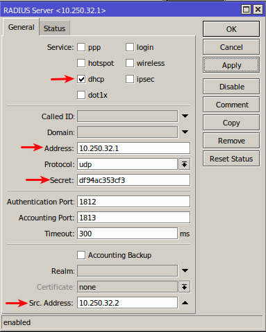

In this case 10.250.32.1 it's a Splynx server IP and 10.250.32.2 our router IP. Specify RADIUS secret in field `Secret` - we will use this in Splynx under router settings and finally enable `dhcp` service.

Once this done we need to enable `RADIUS incoming`:

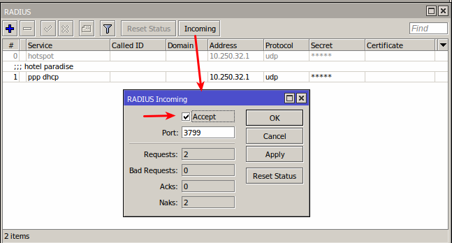

### Step 2 - Configure DHCP server on a router

We can setup a DHCP server using setup wizard or manually.

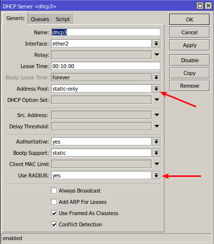

The main options here are: `Address pool=static-only` (it means that Splynx will assign IP) and `use RADIUS=yes`. Specify name, correct interface and lease time and save settings.

### Step 3 - add new router in Splynx

Now we need to add a new router in Splynx under _Networking -> Routers -> Add_ :

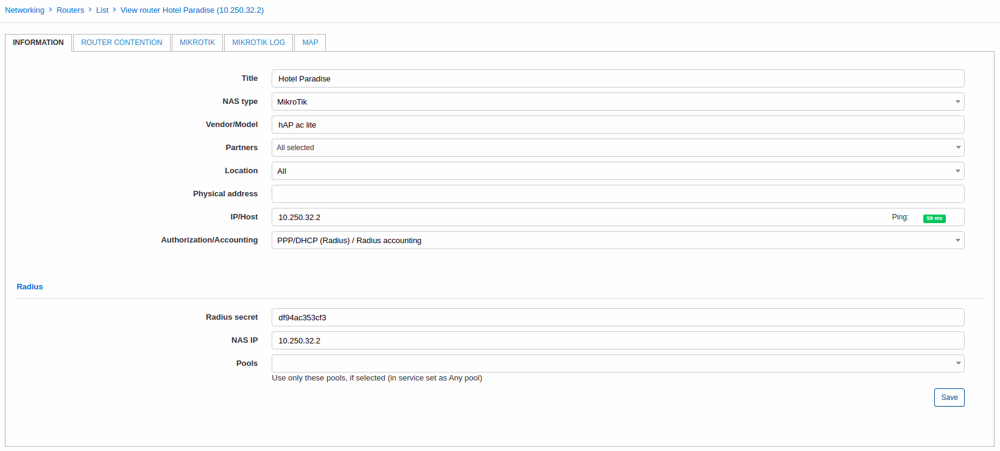

Main parameters here:

1. **IP / Host** - IP of a router;

2. **Authorization / Accounting** - PPP/DHCP (Radius) / Radius acounting;

3. **Radius secret** - the same secret as for RADIUS server on a router;

4. **NAS IP** - IP of a router.

### Step 4 - create IP network in Splynx

#### IP assignment - static IPs (recommended)

In case you will use static IPs in Splynx you need to navigate to _Networking / IPv4 Networks / Add_ and add some network with `Type of usage = static`:

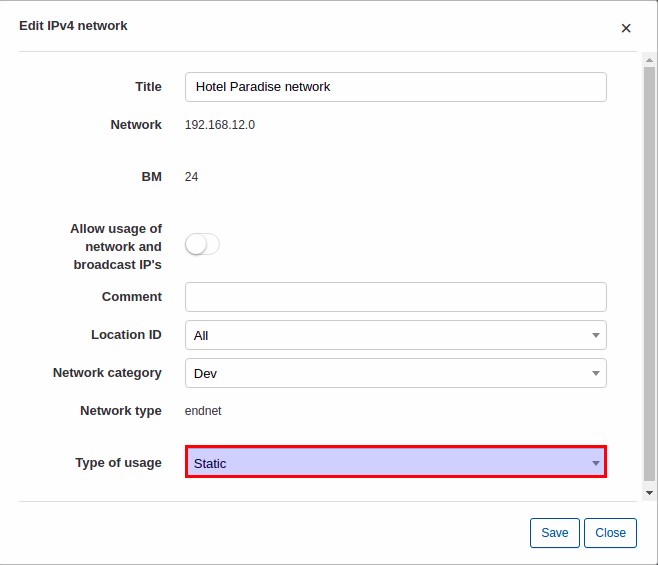

#### IP assignment - assign IP from pool

In this case we need to create IPv4 network with `Type of usage = Pool`:

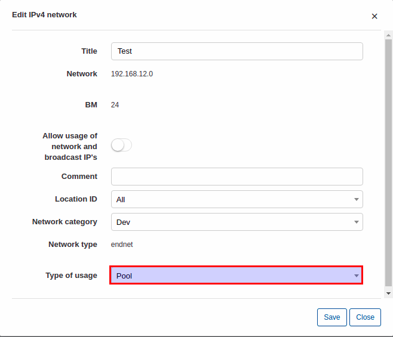

### Step 5 - add the internet service for a client

#### Static IP (recommended)

Under _Customers -> List_ select some customer, open tab _Services_ and add a new internet service with following networking parameters:

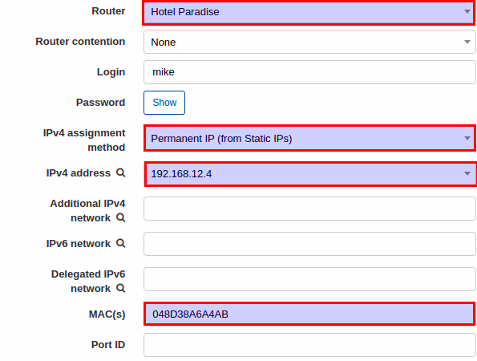

Select router, `IPv4 assignment method = Permanent IP(from static IPs)`, select IP address and specify client's MAC address.

Once this done client should be connected:

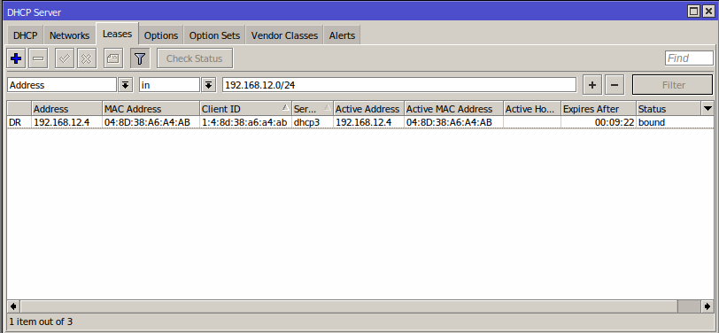

On a router under _Leases_ tab we can see a DHCP lease with IP what we specified in Splynx.

In Splynx we can see that customer is online.

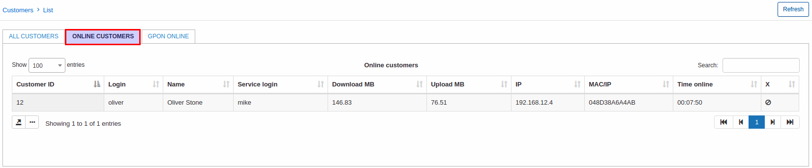

We can add more MAC addresses to a service field _MAC(s)_:

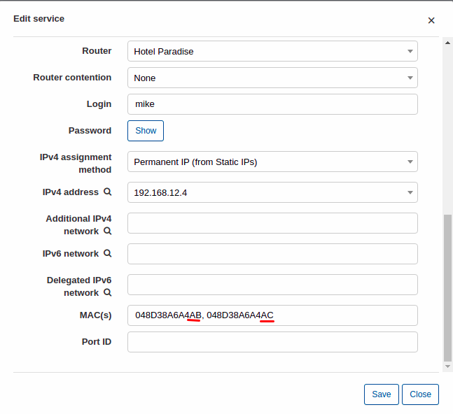

So customer connection with second MAC address can be authenticated:

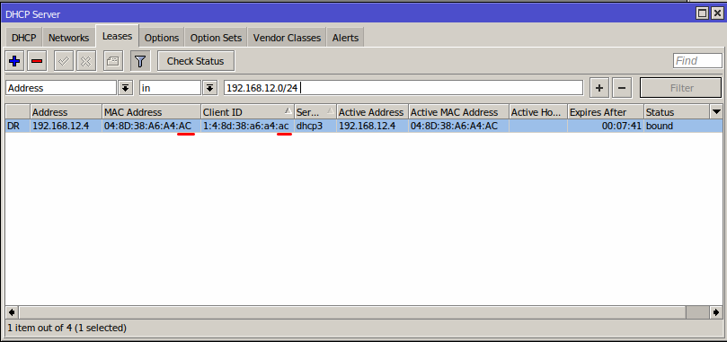

#### IP from pool

Under _Customers -> List_ select some customer, open tab _Services_ and add a new internet service with following networking parameters:

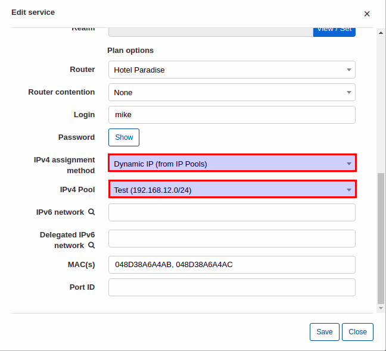

and this connection will receive some IP from a specified pool:

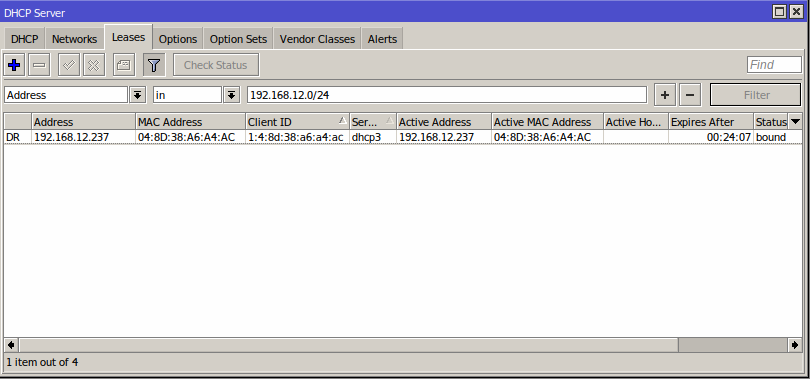

Some advanced parameters for RADIUS can be configured under [Config/Networking/Radius](../../../configuration/network/radius/radius.md) and [Config/Networking/Radius Extended](../../../configuration/network/radius_extended/radius_extended.md).

Blocking of customers will be performed with using of reject IP pools. More information about customer blocking here - [Blocking of customers in Splynx](../../blocking_customers/blocking_customers.md)

### Troubleshooting

#### Additional network issue for services with static IPs

If you set additional network(s) in Splynx internet services, network routes will be sent to the router (NAS) during authorization. The router will then send all traffic with destination=additional network to the customer device. It is possible that these routes will also appear on the customer's device. To fix this issue, set use-framed-as-classless to no in the DHCP server settings:

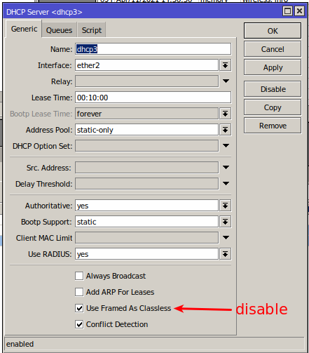
