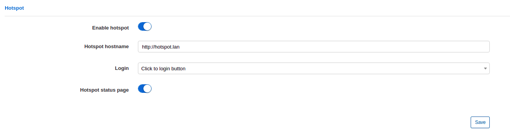
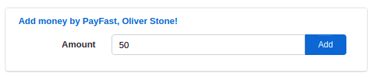

Mikrotik Hotspot Login from Splynx portal
==========================================

This Splynx feature allows you to set up fully automatic customer registration and internet usage via Mikrotik Hotspot. Automatic registration can be done with [Splynx self-registration add-on](addons_modules/self_registration/self_registration.md). Customers can pay for the internet by using one of [payment systems](payment_systems/payment_systems.md). And then customers can login to Mikrotik Hotspot using Splynx portal. No admin intervention is required to register customers and to let them use internet (activate customers, create service etc.).

### How it works (scheme)

* The customer is trying to connect to a Hotspot network(connect to Hotspot wi-fi);
* Router (NAS) redirects the customer to Mikrotik Hotspot IP (to router IP);
* Mikrotik Hotspot redirects the customer to Splynx portal (to Splynx URL);
* The customer authenticates on the portal and logs in into Mikrotik Hotspot on the Splynx portal in 1 click;
* Customer can browse internet.

### Specifications

In this setup we are using Splynx server(cloud) and Mikrotik hAP AC lite with wi-fi interface(SSID = Paradise).
Splynx server has public IP 139.XX.XX.202 and running [OpenVPN server](../../../configuration/tools/VPN/openvpn.md) with IP 10.250.32.1. For Hotspot we will use network 10.10.10.0/24 what is already created under *IP->Pools*.
10.10.10.1 - Hotspot address. As a hotspot client we will use Android phone.


### Splynx settings

Add a router under Networking/Routers:


It can be configured under _Config / Main / Portal_ on tab "Per partner settings":


* **Enable hotspot** - Enable or disable this feature.
* **Hotspot hostname** - Should be the same as in Mikrotik settings. Under *IP - Hotspot* on tab  "Server Profiles" field _DNS Name_ :


* **Login**:
  * **Automatic, after login to portal** - customer will be logged in to Hotspot automatically just after entering to Splynx portal;
  * **Click to login button** - Hotspot login button will appear on the Splynx portal page. Customer will be logged in to Hotspot after he press this button.

  

  * **Disabled** - Hotspot login button will appear on the Splynx portal page. Customer won't be logged in to Hotspot after he press this button.
  * **Hotspot status page**
  * **Enabled** - show Mikrotik Hotspot status and statistic after successful login;
  * **Disabled** - show text "Hotspot connected..." after successful login.

### Mikrotik settings

We need to use custom Hotspot HTML pages. You can download it here - [new_hotspot.zip](networking/authentication_users/mikrotik_hotspot_from_portal/splynx-hotspot.zip)

1. Extract the archive;

2. Replace http://139.XX.XX.202 to your own Splynx URL in all HTML files(don't use last slash in the URL). In Linux you can do it using `sed` command. In the folder with HTML files, where zip archive was extracted, run it in the terminal:
    ```bash
    sed -i s%http://139.XX.XX.202%http://yoursplynxurl%g *
    ```
    \* replace **yoursplynxurl** with the actual domain name or IP. Once this done open each file in a root folder and check if you have correct URLs in each file;

3. Copy modified files into Mikrotik files. To copy, you can use FTP, SSH, Drag and Drop, etc;

4. Under Hotspot Server Profile on tab "General" set *HTML Directory override* to the directory just copied:
   

5. Under Hotspot Server Profile on tab "Login" set *Login By* to **HTTP CHAP**:
   

6. If you want to use RADIUS authorization, enable **Use RADIUS** under Hotspot server profile on tab "RADIUS". And add RADIUS entry:
   

   

7. Add IP address of the Splynx server to the *Walled Garden IP List* to give access to the Splynx portal for unauthorized customers:

   

**Please note**:
* First Active internet service will be used for login via Mikrotik Hotspot;
* The customer will be redirected to Splynx portal only if he is trying to connect to HTTP web-page (not to HTTPS).


### RADIUS authorization

In this scenario we will use a simple configuration, without using IP pools from Splynx. Router (NAS) will assign IP addresses for customers.

1. The customer registered using [Splynx self-registration add-on](addons_modules/self_registration/self_registration.md), internet plan was selected during the registration;
2. The customer was informed to connect to wi-fi network with name "Paradise":


3. After click on "Sigh-in" button the customer will be redirected to Splynx portal login page:


4. After login to portal, on a dashboard the customer will see window like this:



and it's needed to add some amount of money to unblock internet access. (In this case we are using PayFast add-on for customers with prepaid type of billing. So customer can add some amount of money what will be enough to unblock internet access.)

5. Once this done customer can click on this button to connect to the Internet:


6. After successful login the customer will be able to see the statistic:


