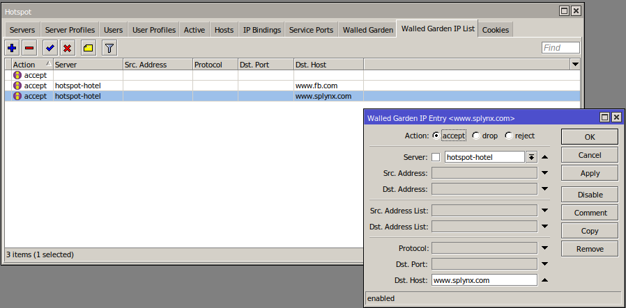

Mikrotik: Hotstpot with Radius
==========

### Hostpot configuration on Mikrotik router

First configuration steps for Hotspot Radius authentication are the same as for other types of Radius authentication.

Router should be added to Splynx and Radius Hotspot authentication enabled. Even, if other Radius authentication method will be chosen in Splynx router settings, it will still allow Radius hotspot authentication.

In this setup we have Splynx v3.1, with enabled [OpenVPN server](https://docs.splynx.com/configuration/tools/openvpn) inside, Mikrotik router hAP ac lite(ROS v6.48) as OpenVPN client:

Splynx(OpenVPN server) IP - **10.250.32.1**

Mikrotik(OpenVPN client) IP - **10.250.32.2**

Once router is added under Networking/Routers, you can set next RADIUS parameters:

* **Radius secret** - the password for communication between Radius server and router;
* **IP/HOST** - this is the physical IP address from where packets are sent to Radius server. In case when router is behind NAT, this is the public IP address of NAT device. Can be set as a domain name or dynamic DNS entry;
* **NAS IP** - the real IP source address for radius packets. It's recommended than in Radius settings in Mikrotik router Src. address = NAS IP in Splynx.

Next step is to configure Radius settings inside the router:

also RADIUS incoming should be enabled:

In configuration of Hotspot we have added IP local pool 10.10.10.0/24:

next step is to add a hotspot server under IP -> Hotspot -> Server:

Under bridge1 interface we have a wireless interface with SSID = "Paradise" to which our customers will try to connect.

The last step is to configure Hotspot server "hsprof1" profile:

on a "Login" tab you can select types of authentication:

by default use "HTTP CHAP" only,

 on a "RADIUS" tab we need to select type of connection, in case of Wireless choose "19/wireless" in case of ethernet please select "ethernet":

Now when we have all things configured, no firewall rules what can corrupt hotspot work we can proceed with connecting customers.

### Hotspot authentication login and password

Let's create some internet service for customer with login = 'ol' and password = 'ol':

Now this customer using a smartphone can connect to a Wi-Fi network with name "Paradise":

After setting the right password and username, customer get access to the internet:

Also we can see that client is active, and "R" means that he was authenticated via Radius server:

And client is online in Splynx, where we can see his session and current usage:

If we would like to close the session of the customer, there is an option(marked by red pointer) in Splynx how to close the session and enforce customer to reconnect.

Also possible setup with assigned static IP in Splynx(set static IP under internet service):

### Hotspot authentication using cookies

When client is already authenticated, Mikrotik can store in cache his information for certain period of time and don't ask him to enter username and password again. Authenticated customer is put to cookies with lifetime specified in settings.

For example, we don't want to ask customer for a password for 24 hours. So, if he will reconnect his device several times during a day to Wi-fi or router, the login and password page will not appear. On example below is shown how to enable the cookies and set the lifetime to 24 hour or 1 day.

### Hotspot MAC authentication

Splynx can recognise the MAC address of customer if it is set to his internet service. If MAC authentication is enabled in Hotspot server profile and MAC is set in customer's service, then the login page will not appear for such customer and he will get internet access immediately.

Enabling MAC authentication in Hotspot profile:

Setting the MAC address of client to his internet service

### Blocking of hostpot users

If client has a static/permanent IP address assigned to the service, than blocking is made via putting IP address to the address list and further redirect. In case of dynamic IP address, the hotspot IP of client is mapped to one of IPs from the blocking range of Splynx. To get more information about blocking customers, please, read our tutorial page - [blocking customers in Splynx](blocking_customers/blocking_customers.md)

### How to allow some resources for customers
Let's say you need to allow access to some resource https://splynx.com for blocked customers, it can be achieved using **Wallen garden** option of Hotspot:

Under tab "Wallen Garden IP" and a new record and simply specify "Dst.Host", select "Server" and action = "accept" to bypass traffic to needed resource without Hotspot authentication.

Mikrotik walled garden allows users to create an exception rule to bypass certain devices on the LAN from hotspot authentication. While the Mikrotik hotspot is one of the much appreciated features in the Mikrotik routerOS, without the use of the Mikrotik walled garden, it will be impossible to connect devices like servers and printers to a network placed behind a hotspot server.

### Setting different values to Radius attributes

In `Config → Networking → Radius` is field available for setting additional attributes.

To understand the usage of Radius attributes customization, please, follow the guide - [Radius server customization](radius_customization/radius_customization.md)

### Useful resources

https://wiki.mikrotik.com/wiki/Manual:Hotspot_Introduction
https://wiki.mikrotik.com/wiki/Manual:IP/Hotspot
https://wiki.mikrotik.com/wiki/Manual:IP/Hotspot/Walled_Garden
https://wiki.mikrotik.com/wiki/Manual:Customizing_Hotspot
