Mikrotik: Local authentication via API
==========

Instead of using Radius, Splynx is able to push authentication rules for customers to Mikrotik router via API.

* **Advantage:**
 * rules for authentication are created in routers and stored there locally. It means, if Splynx or Radius server will not respond, customers will be able to get the Internet access.


* **Disadvantages:**
 * under internet service settings in Splynx router must be specified;
 * only static IPs assignment method will work (because API is writing queue and secret/lease to router and IP should be specified).


Authentication rules can be added via API for:

* PPP Secrets;
* DHCP Leases;
* Hotspot users.

### Step 0 - add a router and configure API connection

In all these types of API authentication is important to have Mikrotik API enabled on router and also in Splynx router settings:

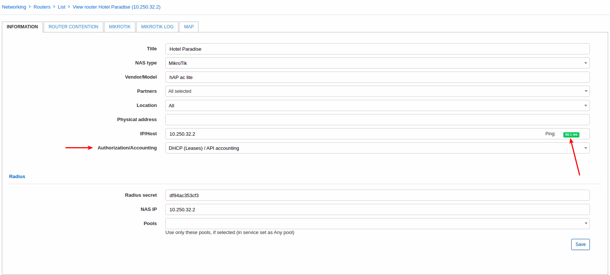

On the _Mikrotik_ tab enable API, set login, password and port, and click on test connection button - the result have to be successful.

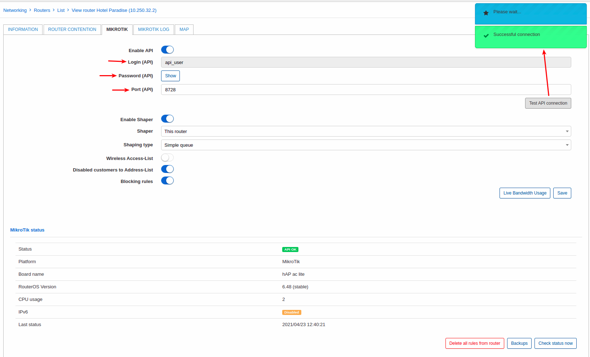


We recommend to user an API user with group of permissions = full on a Mikrotik as we constantly add new features what might require more permissions. This API user can be configured with `Allowed address = Splynx IP` to be accessible only for Splynx server:

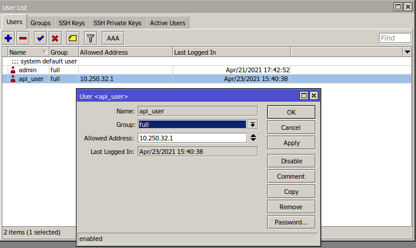

Below are described all types of API authentication and how Splynx covers it with Mikrotik RouterOS:


### DHCP Leases via API

On a Mikrotik router we have a DHCP server running, routing is configured and  API connection between Splynx and the router established. Now we need to make next steps in Splynx:

1. Select method of `Authorization/Accounting = DHCP (Leases) / API accounting` under router settings:


2. Create the internet service for the customer with selected router and `IPv4 assignment method = Permanent IP (from static IPs)` and MAC address of customer's equipment (you can specify 1,2 or more MAC addresses in this field depending on Splynx settings).

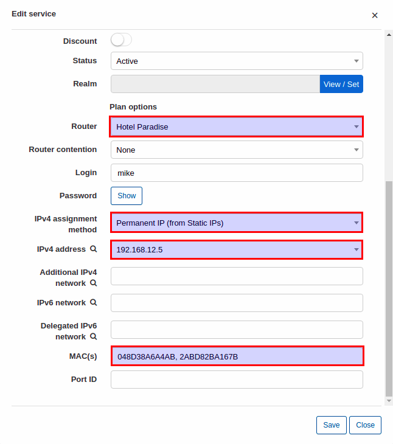

**NOTE!! Only permanent IP works in API authentication**

Now try to connect customer's device to the Internet. Once connected an active DHCP lease should be visible under *IP -> DHCP server -> Leases* on a router:

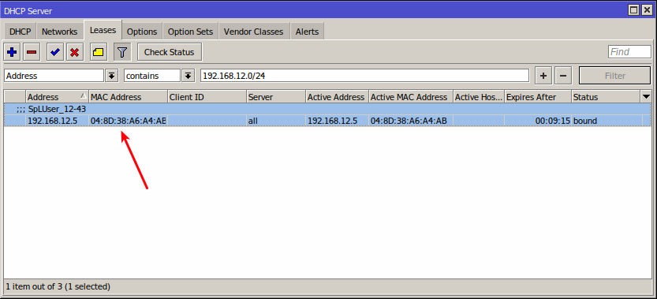

And customer is online in Splynx:

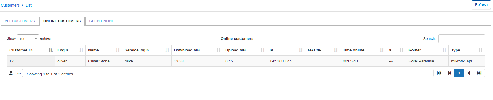

Once customer is blocked, internet access will be limited for a customer and under *IP -> Firewall -> Address Lists* you will see this record:

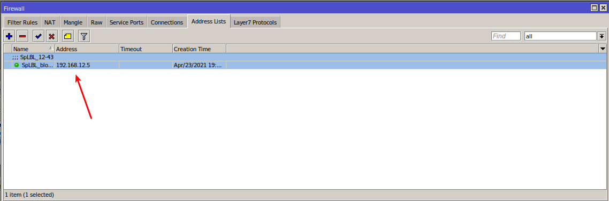


### Mikrotik PPP Secrets via API

First of all, select PPP secrets as type of authentication in Spynx router settings:

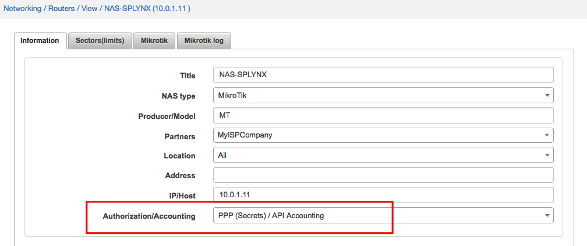


Then in internet service of customer should be selected a router where Splynx will push authentication rules and also grab statistics from. Login and password should be specified there and also Permanent IP address. API authentication works well only with permanent IP assignments. In case of dynamic IP assignment, Splynx will not know which IP is used by customer and will not be able to gather statistics from IP accounting of Mikrotik router.

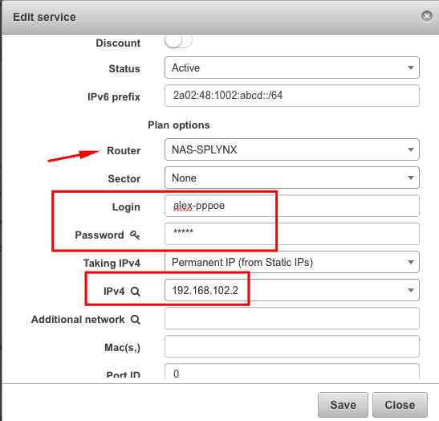

After saving, Splynx will connect to router and create entries in `PPP → Secrets`:

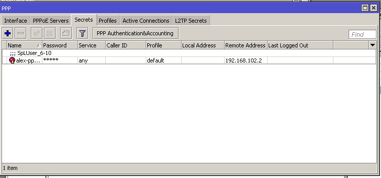


### Mikrotik Hotspot users via API

Select Hotspot users as type of authentication in Splynx router settings:

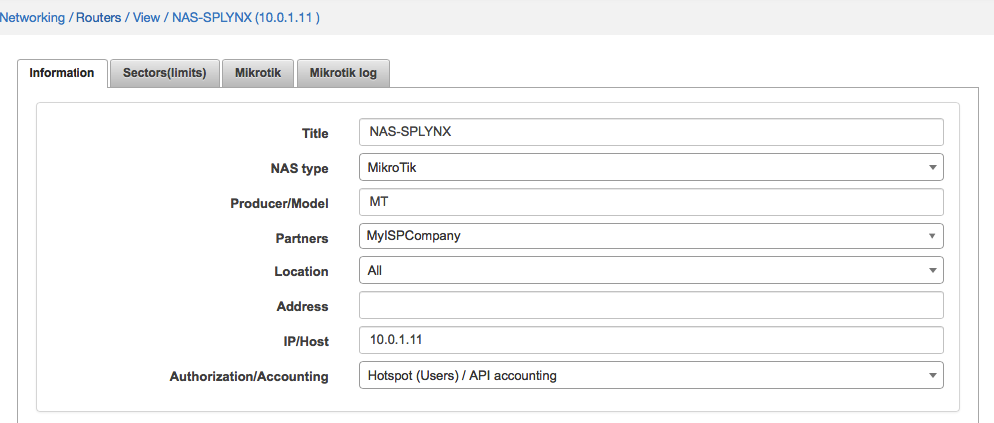


In internet service of customer: permanent IP address should be selected and router should be specified. Login and password are values for hotspot entry. In case of MAC authentication you can specify a MAC address of end user:


When it saved, Splynx creates IP hotspot entries in Mikrotik router under `IP → Hotspot → Users`:

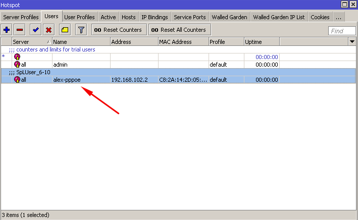

---
When authentication type is configured and Splynx pushed the rules to Mikrotik router, we can see clients coming online in 5 minute interval. Splynx grabs statistics from Mikrotik routers via API every 5 minutes. The log of accounting you should be able to find in `Splynx → Networking → Routers` under Mikrotik API log tab:

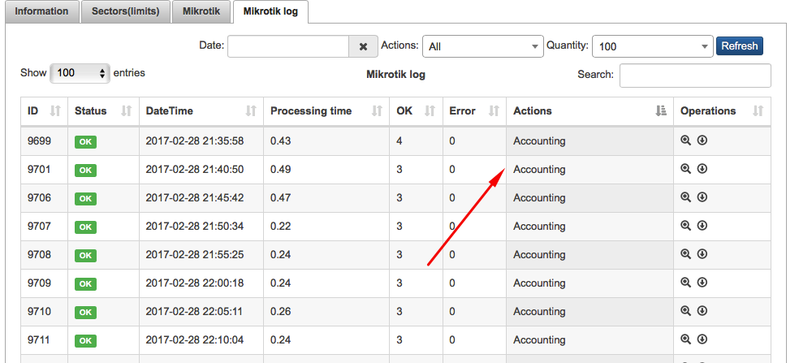

### Troubleshooting

If PPP secret or DHCP lease or Hotspot user is not created on the router via API, please check if IP address is specified in customer's internet service settings. Also Router should be specified there. For DHCP also check MAC address. It should be set.

#### Accounting
If you see accounting records in Splynx Mikrotik log but accounting data is wrong, check if IP Fastpath is enabled - disable it:

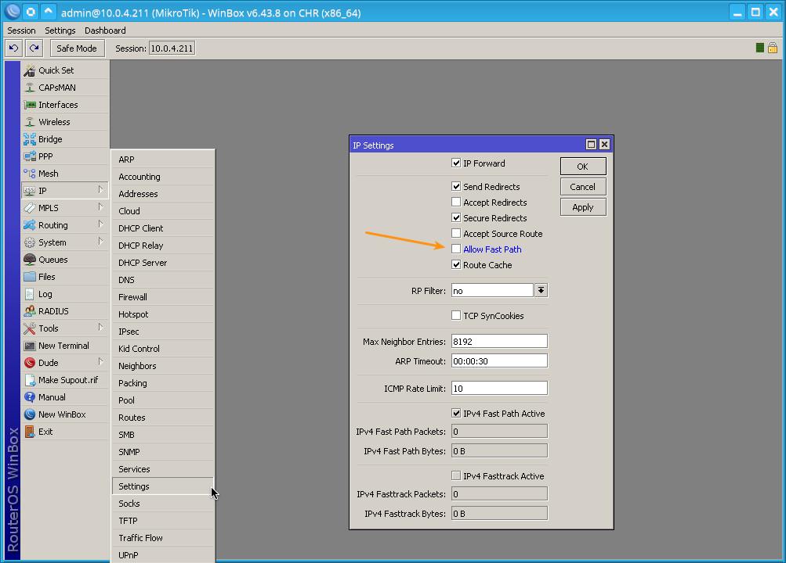

---
If you do not see accounting records in Splynx Mikrotik log, check in database if there is correct time of last API connection for gathering accounting.
Issue this in command line:

* For Debian:
```bash
root@debian# echo "select last_accounting from routers_mikrotik;" | mysql splynx
```

* For Ubuntu:
```bash
user@ubuntu$ echo "select last_accounting from routers_mikrotik;" | mysql -u debian-sys-maint -p splynx
```
For Ubuntu you can find the password for debian-sys-maint MySQL user in the file `/etc/mysql/debian.cnf`.

If any of given times is in the future, you can reset all times by issuing:

* For Debian:
```bash
root@debian# echo "update routers_mikrotik set last_accounting = '0000-00-00 00:00:00';" | mysql splynx
```

* For Ubuntu:
```bash
user@ubuntu$ echo "update routers_mikrotik set last_accounting = '0000-00-00 00:00:00';" | mysql -u debian-sys-maint -p splynx
```
You can find the password for debian-sys-maint MySQL user in the file `/etc/mysql/debian.cnf`.
