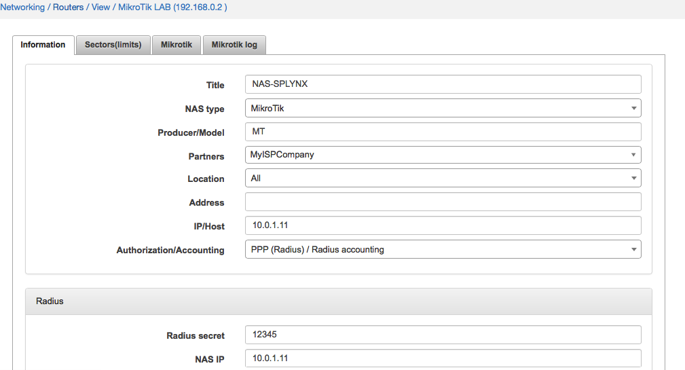
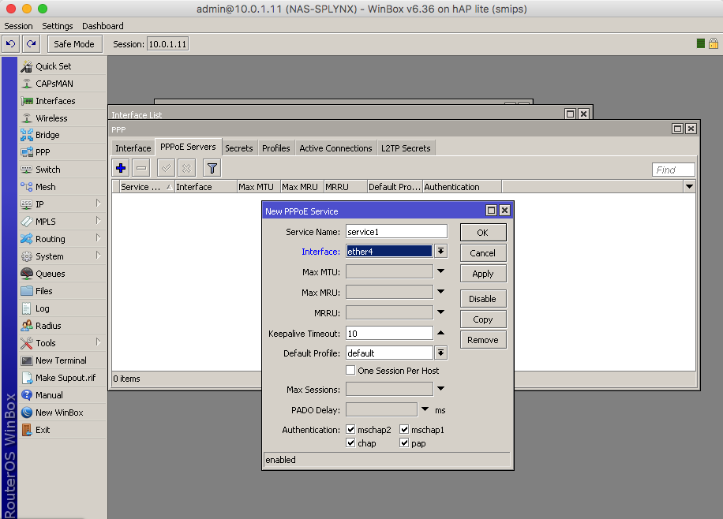
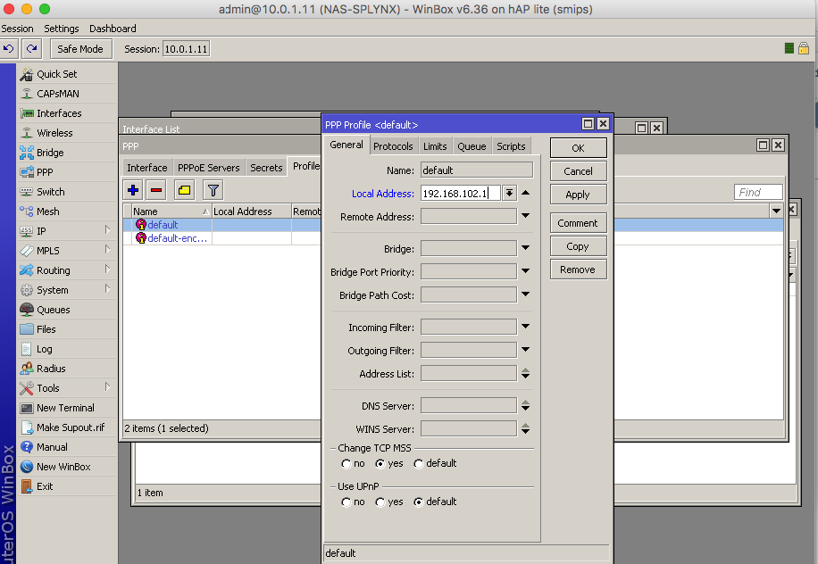
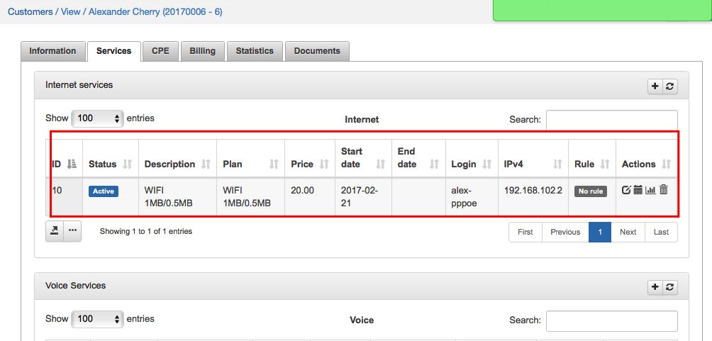
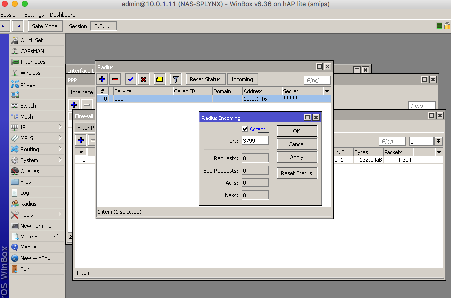

Mikrotik: PPPoE, Radius
==========

The setup shown below is equal for all types of tunnels in Mikrotik, that are configured under ppp secrets: ppp, pptp, l2tv, ovpn and pppoe. The particular example is using PPPoE configuration.

There are several areas described in tutorial:

1. Connecting Mikrotik router to Splynx Radius server
2. Customer connection to router and authentication
3. Disconnecting/blocking users from Radius server
4. Closing PPPoE sessions
5. Setting different values to Radius attributes

### Connecting Mikrotik router to Splynx Radius server

As the first step, it's needed to add a router to Splynx under menu `Networking → Routers`:

Radius secret - the password for communication between Radius server and router.

IP/HOST - this is the physical IP address from where packets are sent to Radius server. In case when router is behind NAT, this is the public IP address. Can be set as a domain name or dynamic DNS entry.

NAS IP - the real IP source address for radius packets. It's recommended than in Radius settings in Mikrotik router Src. address = NAS IP in Splynx.

Next step is to configure Radius settings inside the router:

Then, define the Interface where PPPoE server runs:

And enable Radius authentication for PPPoE server (and other ppp services) in the Secrets tab of router settings:

Very important thing is to define the Local IP address in Profile. It's used as a local IP of PPPoE server for establishing PPPoE tunnel. Tunnel will not be established without specifying the Local IP and you will get Local IP error in logs. Remote IP will be assigned by Splynx Radius server.

### Customer connection to router and authentication

When router is connected to Splynx Radius server we can add a new customer and create internet service for him in Splynx software:

IP address can be assigned on permanent basis by Splynx Radius or dynamically (every time when customer connects he will get different IP from pool). PPP login and password are taken by default from the main Splynx customer login/password credentials. This can be changed in service and ppp and Splynx portal login and password will be different in this case:

Now we can connect CPE or PC of customer with username alex-pppoe and password 12345. All communication between Splynx Radius server and Mikrotik router is available in logs under `Splynx → Administration  → Files → Radius` short (radius/short):

For further troubleshooting please visit the topic [Troubleshooting Radius server](networking/troubleshooting_radius/troubleshooting_radius.md).

### Disconnecting/blocking users from Radius server

When customer changes the status from Active to Blocked, Splynx Radius server pushes the Change of authorization (COA) message to Mikrotik Router. The COA message contains the name of address list where customer's IP should be put. It doesn't matter if  customer has permanent or dynamic IP - his current IP address will be put to the address list Reject_1. When we change back the status to Active, the address list Reject_1 is rewritten via COA message to "Active". Other option to block the customer's session is to use disconnection of the session. Session is disconnected and when client reconnects it he is put to address-list (in case of permanent IP assignment) or he receives IP from special blocked IP pool (dynamic IP assignment). For both types of blocking sessions it's needed to enable Incoming communication on Mikrotik Router side:

Please, find more information about blocking customers on the tutorial page - [blocking users in Splynx](networking/authentication_users/blocking_customers/blocking_customer.md).

#### Closing PPPoE sessions

By default Splynx don't close the sessions of customers if it's not requested by administrator. It means that in Statistics of customers a session can remain active for a long time. This can cause the misleading with communication with customers. To close the session automatically every 24 hours it's possible to configure the session timeout in Mikrotik router settings:

Or add a attribute to rate-limit field inside `Splynx → Config → Networking → Radius`

Also, there is a way in Splynx how to close the session and enforce customer to reconnect. It's available through "X" button in service of the client or in Online view if the "X" option is added to the list of table.

Service close session:

#### Setting different values to Radius attributes

In `Config → Networking → Radius` is field available for setting additional attributes.

To understand the usage of Radius attributes customization, please, follow the guide - [Radius server customization](networking/radius_customization/radius_customization.md)
