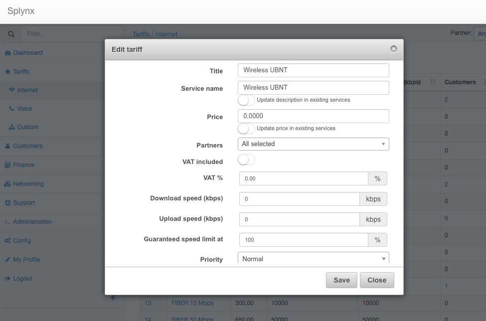
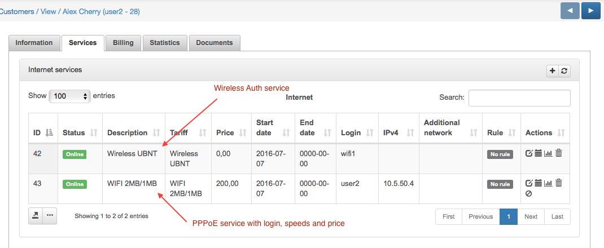
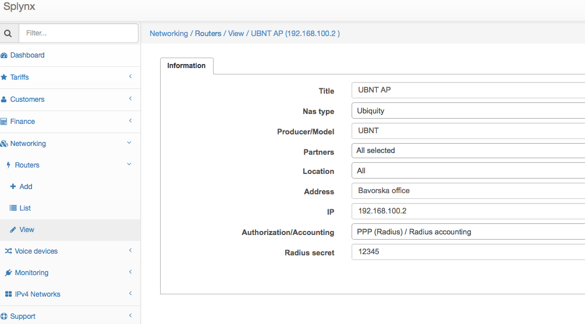
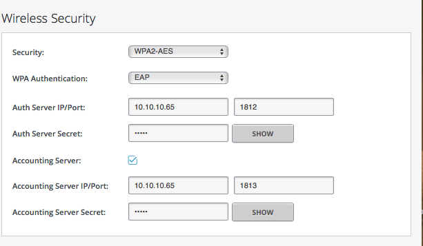

Ubiquiti: Wireless auth, Radius
==========

Ubiquiti access points have the ability to authenticate CPEs via Radius server. This means the admin doesn’t have to maintain local passwords for wireless authentication, each CPE/radio can have its own account in the Splynx ISP Framework and our Radius server will authenticate UBNT CPEs.

Usually ISP already has a PPPoE or similar authentication mechanism which is why wireless Radius authentication is added in Splynx to existing customers as one new (empty) service.

As a first step, we define a Plan in Splynx with 0 price and 0 in all other fields.

Then, we should add a wireless service to the customer and enter his login and password.

It is also important to add AP to splynx.

In the last step we should enable Wireless Radius authentication EAP on the UBNT router and setup a Radius server IP address and secret.

Now we can connect a UBNT radio CPE to a UBNT Access Point:

One thing that you must do is to setup Message-Authenticator attribute to to the Radius configuration.

Under `Config → Radius → NAS Ubiquiti → Add Message-Authenticator=0` to the rate limit attributes field :

EAP-TTLS authentication should work from Splynx version 2.1
