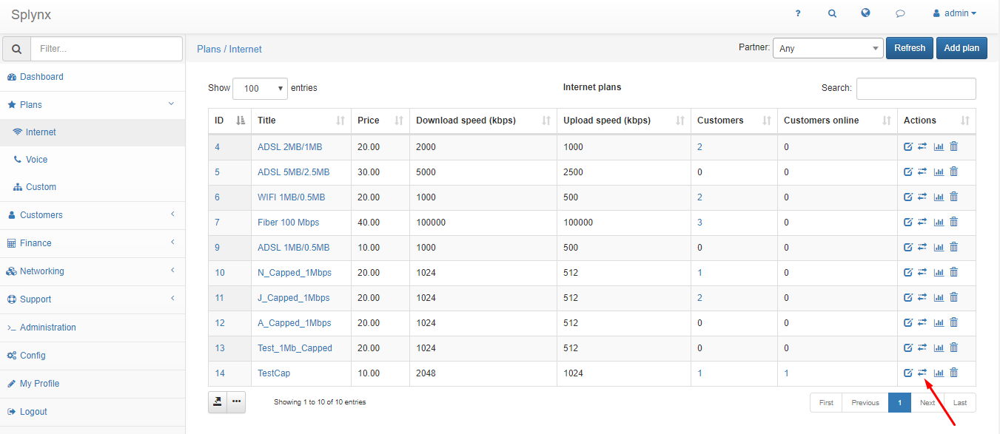
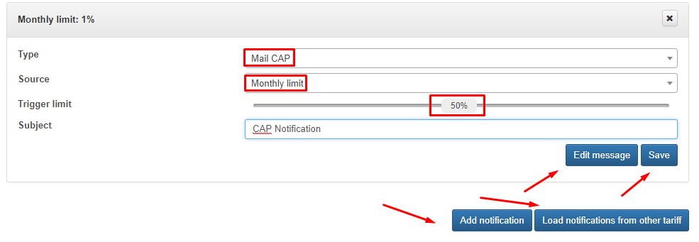
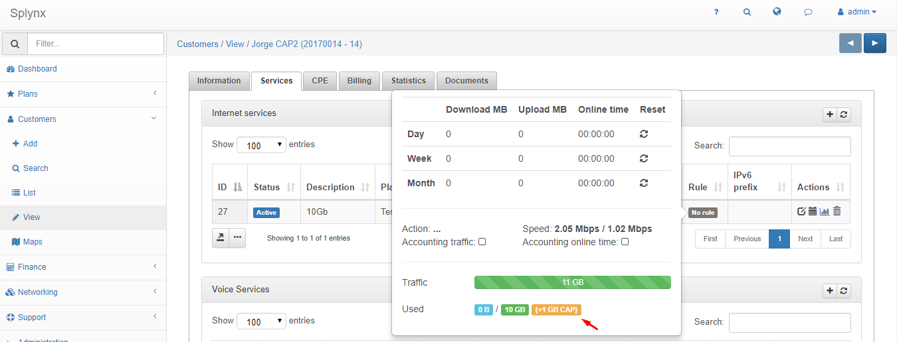
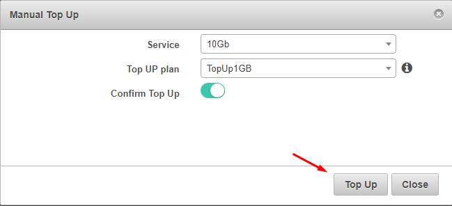

Capped plans and top up
==========

CAP is a feature that allows ISP to provide Internet services with monthly limitation of data and charge customers for additional data.

The advantage is that customer can pay more to extend his CAP using the tool Top Up. Administrator designs Top Up plans, that are avaliable for customers in addition to their regular Internet plans.

### CAP configuration

To configure CAP policies go to `Tariffs → Internet`, and then choose selected plan and click on FUP button, there will appear a new window called CAP.

In CAP there are 3 configuration boxes, Monthly limits(CAP), Top Up Plans and Notifications.

In the first, we can set how many data(in KB, MB, GB or TB) customer in Internet plan is able to consume. It can be dowload, upload or bidirectional usage. When the CAPed monthly data are used, Splynx automatically blocks user or reduce his speed according to the configured percentage level.

Also, you can disable daily or weekly limits set on FUP or enable the Rollover mode. Rollover means that the unused monthly data of the CAP will be moved to the next month.

In the second box you can find the Top Up Plans configuration. This plans are for use when monthly data of CAP is fully used. Customer pays for a Top Up, and then he received more data to use.

You can set the validity of Top Up data. It can be unlimited or set to several months. Also there is an option add Top Up to the customer invoice.

Very useful option is to Load plans from other tariffs. So, you can configure Top Up plans once and then just copy the settings to all your tariffs.

The third is the Notification box, which informa by email or SMS about monthly usage, Top Up data usage or Top Up actions.

Also is possible to load notifications that we have created in other plan.

Source means the counter or action that we want to notify our customer about.

Monthly limit - the data included in CAP,

Top Up usage - notify customer when certain % of his the top up is spent

Top Up action - notify when top up was added to customer's account

Auto Top Up - send a notification when customer's account data were automatically added by Splynx.

You have to write a subject and customize the message clicking on Edit message. There you can also load a template you have created in section `Splynx → Config → Tempates`.

To check if the email or notification are working correctly, you can view the email log clicking on `Administration → Logs → Email`.

The same verification is available for SMS messages in `Splynx → Administration → Logs → SMS`

### Top Up

Splynx works with 3 types of Top up :

1. Administrative top up
2. Customer portal top up
3. Auto top up

#### 1. Administrative Top up

In first case, go to `Customers → List` and choose the customer you want add the Top Up, then in the window information at down side on right, there is the CAP Top Up options, click on the Top UP button. It will open a new window that is asking for a service and Top up plan. Administrators can have permission to add custom top up - it means they can define the Data to top up and the price of singe top up.

When we create a Top UP for 1 GB we can see that 1GB of data were added to customer's account. The transaction is on the list and we can proceed to charge for generating the invoice.

As we have enabled the option "To invoice" in the Top UP transaction, the Top up appears on invoice PDF :

#### 2. Customer portal Top up

In second case, customer can order a top up in the portal. The administrator configure in Splynx the permissions and options that the customers have. This configuration is on `Config → Main → Portal`. There are two boxes with some options for customer's Top Up:

1. Yo can enable Top Up and edit auto top up settings. Auto top up permissions shows if client can enable/disable auto top up and if he can choose from top up plans. Also there is an option to allow to customer to change the maximum amount of auto top ups per month

2. To enable manual top up from portal, select which type of document will be created when customer top's up from the portal. Pay before means that customer will not get the top up data until he pays the invoice.

When customer enters on Portal, he clicks on Services → Top Up were there are the top up options - for automatic and/or manuall top up.

In the manual top up customer should choose the plan and add a top up.

Then in Statistics customer can see the amount of traffic in the bar. Also there are displayed his actual top up data.

In case when administrator sets the option Pay Before Top Up, the data will be available after customer pays for it.

So, the invoice is paid and other 1GB data is added now.

#### 3. Auto Top up

Inside the CAP window in customer information we can enable auto top up.

Then we define the auto top up plan and maximum of top up per month.

Transfer usage to new service means that Splynx will transfer unused data between plans in case when customer changes his plan.
