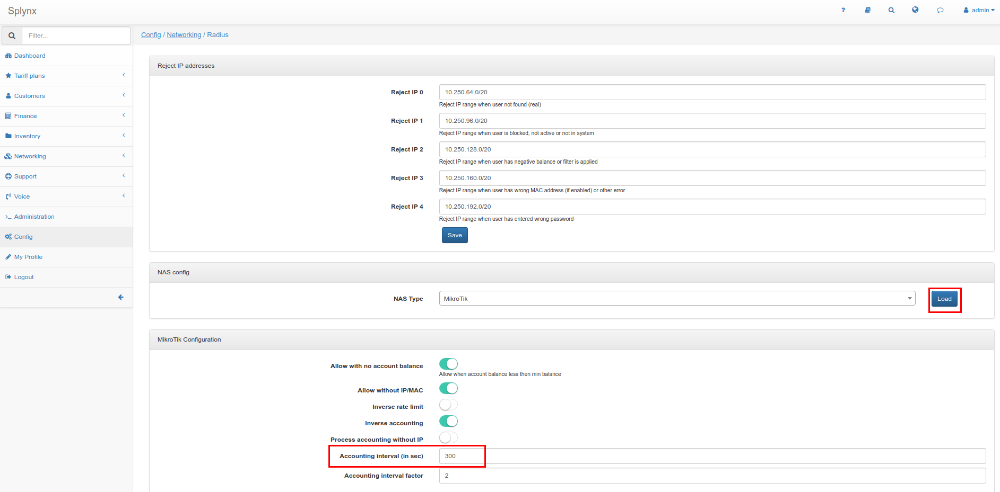
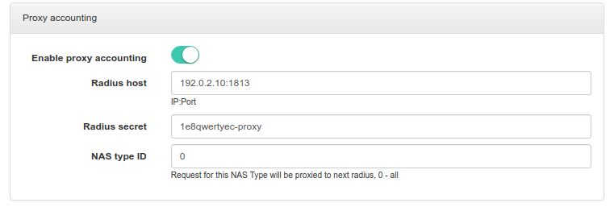
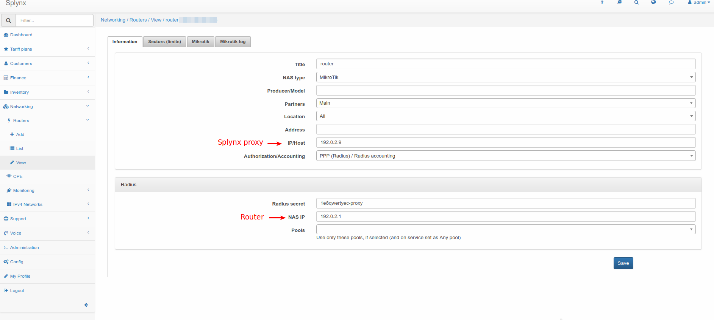

Radius Proxy Accounting
=======================

Splynx has abillity to proxy[[1]](#one) RADIUS accounting packets to another RADIUS server. In this case, customers' traffic will be accounted on more than one RADIUS server.

## Radius Accounting process
During RADIUS authorization, if customer is allowed to connect, RADIUS server[[2]](#two) sends to NAS[[3]](#three) **RADIUS-Accept** packet with **Acct-Interim-Interval** Attribute (among other attributes). This attribute contains the number of seconds how frequently NAS should send traffic usage updates[[4]](#four) to RADIUS server.
You can change this time in Splynx under **Config / Networking / Radius / (choose NAS type) / Load / Accounting interval (in sec)**.

## Radius Proxy Accounting 
After session starts, NAS sends traffic statistics every **Accounting interval (in sec)** seconds, as was mentioned. If you enable **Proxy accounting** under **Config / Networking / Radius extended**, Splynx will copy these RADIUS Accounting packets to _IP:port_ specified in **Radius host** field.

## Splynx as Remote RADIUS Accounting server
To use Splynx as a Remote RADIUS Accounting server, create Router under **Networking / Routers**.

**IP/Host** - IP address (hostname) of Splynx proxy server.
**NAS IP** - IP adderss of the router (NAS)

***
[1] RADIUS Proxy Accounting behaviour in Splynx is a bit different from described in [RFC 2866](https://tools.ietf.org/html/rfc2866). Splynx RADIUS server answers to NAS immediately and just copies Accounting data to another server. "Classic" RADIUS Proxy Accounting server first sends Accounting Request to remote server and answers to NAS only after Accounting Accept is received from remote server.
[2] Splynx server.
[3] Network Access Server, **Router** in Splynx terminology.
[4] Interim-Updates 
