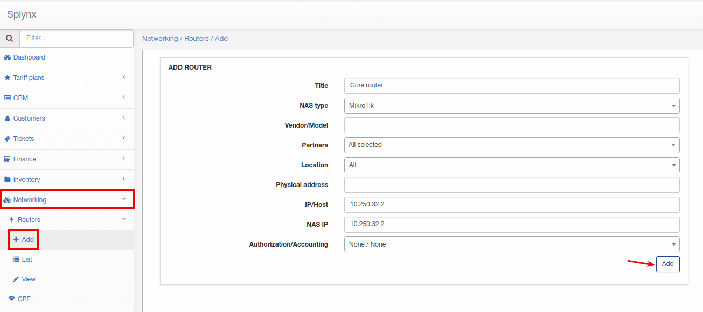
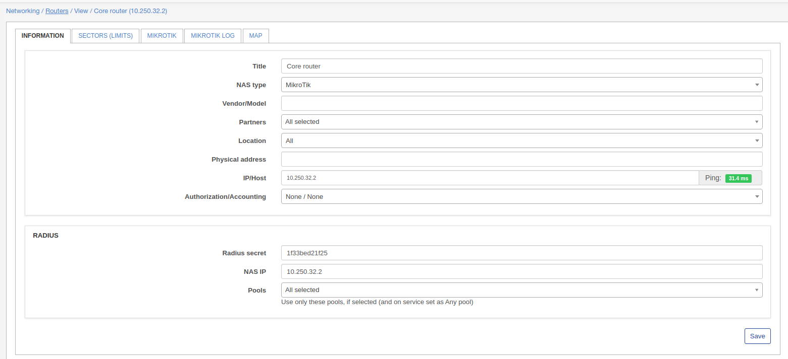
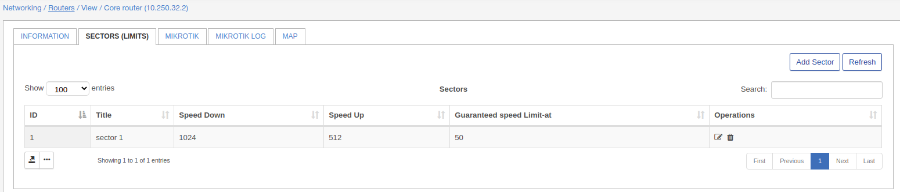
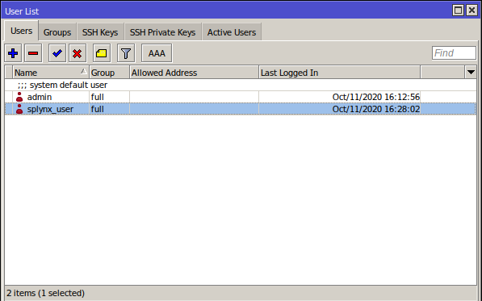
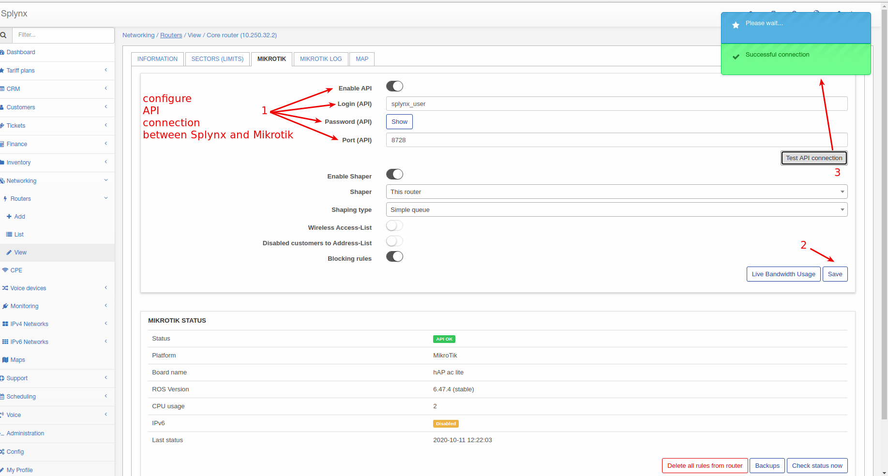
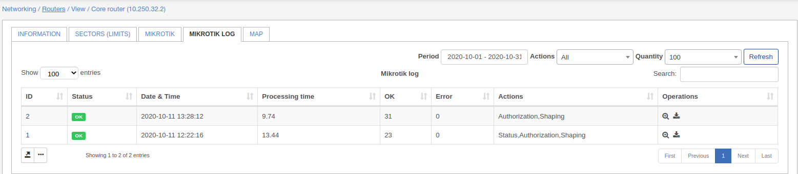

Routers settings
==========

Networking / Routers - is the place where you can add and configure your routers (Network Access Servers).

To add a new router click on **Networking -> Routers -> Add**:

Here you need to specify:

* **Title** - name for a router;

* **NAS type** - select NAS type for a new router. If you don't find needed NAS type here, it can be added under *Config -> Networking -> NAS types*;

* **Vendor/Model** - vendor and model of a router;

* **Partners** - select needed partners who can use this router;

* **Location** - select locations;

* **Physical address** - specify physical address of a router;

* **IP/Host** - Router's IP address, this is the physical IP address from where packets are sent to Radius server (to Splynx). **In case when router is behind NAT, this is the public IP address of NAT device.** Can be set as a domain name or dynamic DNS entry;

* **NAS IP** - RADIUS server attribute **NAS-IP-Address** (RADIUS server "Src. address" field on a Mikrotik router). If field "Src. Address" is specified on a Mikrotik RADIUS server - NAS IP(in Splynx) must be the same;

* **Authorization/Accounting** - type of Authorization/Accounting:

  *  **None / None** - useful for different not standard scenarios;
  *   **None / API accounting** - useful for different not standard scenarios. In addition to previous, Mikrotik API accounting will be used;
  *   **Firewall IP-MAC filter / API accounting** - Mikrotik API will be used to push firewall filter rules into the router. This is useful for Static IP addresses. When customer sets IP address on the equipment manually;
  *   **DHCP (Radius) / API accounting** - DHCP server on the router will use Radius authorization. Accounting will be made with Mikrotik API;
  *   **DHCP (Leases) / API accounting** - Mikrotik API will be used to push DHCP leases into router. **Do not forget to set MAC addresses for internet services**. Accounting will be made with Mikrotik API;
  *   **PPP (Radius) / Radius accounting** - PPPoE/PPTP/OpenVPN server will use Radius authorization. Radius accounting will be used;
  *   **PPP (Secrets) / API accounting** - Mikrotik API will be used to push PPP secrets into router. Accounting will be made with Mikrotik API;
  *   **Hotspot (Users) / API accounting** - Mikrotik API will be used to push Hotspot users into router. Accounting will be made with Mikrotik API;
  *   **Hotspot (Radius) / Radius accounting** - Mikrotik Hotspot server will use Radius authorization. Radius accounting will be used.

 **NOTE!**
 *Even if Authorization = None or API authorization is used - Radius authorization and Radius accounting will work.*

*If API Authorization is used - do not forget to choose specific router in internet service settings (with router = None this will not work).*

*If API Authorization is used - Mikrotik API should be enabled and configured on the _Mikrotik_ tab and in Router settings.*

**API ACCOUNTING** - Splynx every 5(can be changed) minutes gathers statistics from a Mikrotik router using Mikrotik APIs;

**RADIUS ACCOUNTING** - Router sends accounting statistic every **n** seconds to Splynx server using RADIUS accounting packets. **n** is configurable value. It can be configured per NAS type under *Config / Networking / Radius / NAS Type/ Load / Accounting interval (in sec)*.

* * *
Once router added you can change few more parameters:

#### RADIUS

* **Radius secret** - Radius secret(field "Secret" under RADIUS server on a Mikrotik);

* **NAS IP** - RADIUS server attribute **NAS-IP-Address** (RADIUS server "Src. address" field on a Mikrotik router). If field "Src. Address" is specified on a Mikrotik RADIUS server - NAS IP(in Splynx) must be the same;

* **Pools** - if selected, use only selected pools for this router. If you want to use all available pools - do not select any. Pools have to be created under *Networking / IPv4 Networks*.

Under **IP/HOST** field you can find a ping indicator, what shows you if a router is pingable or no.

* * *
### SECTORS(LIMITS)
Under this tab you can add/edit sectors with some limits:

### Mikrotik

On this tab API connection between Mikrotik router and Splynx over Mikrotik API. To do this we have to create a new user on a Mikrotik under (System - Users) like i did it:

I'll use *splynx_user* to link router with Splynx:

I configured all parameters in step 1(on a screenshot), save configuration on a step 2 and test connection on a step 3 and got a result.

Few more parameters to configure:

* **Enable shaper** - enable/disable shaper;

* **Shaper** - select shaper;

* **Shaping type** - select shaping type. More info about shaping is [here](../bandwidth_management/bandwidth_management.md).

* **Wireless access list** - if enabled, and service of a customer has MAC address specified, MAC address of a service will be added under *Wireless - Access list* on a Mikrotik;

* **Disabled customers to Address-List** - used for API authorization. This option changes the blocking behavior. If disabled - credentials of blocked customers will be reemoved from the router(hotspot users, PPP secrets firewall rules and DHCP leases) and if enabled - blocked customers will be placed to some of the address lists;

* **Blocking rules** - enable/disable blocking rules. If disabled - customer connected to this router won't be blocked.

Under **Mikrotik status** window you will last status of API connection, router model, ROS version, CPU usage, status of IPv6 and datetime of last received status.

There are 3 more buttons:

* **Delete all rules from router** - by click on this button all API rules will be removed from a router. If you need to use this, click on it and after that disable switch "Enable API";

* **Backups** - by click on this button you will see available backups of a router;

* **Check status now** - force check of status.

### Mikrotik log

Here you can find Mikrotik logs:

Files can be viewed of downloaded.

### MAP

Under this tab you can configure displaying of a router on a map by specifying geo data for a router.

Splynx supports different router models from different producers. Below are configuration tutorials for vendors that are used most often:

* [Cisco routers](cisco/cisco.md)

* [Juniper routers](juniper/juniper.md)

* [Mikrotik routers](mikrotik/mikrotik.md)

* [Ubiquiti Edge routers](ubiquiti/ubiquiti.md)

* [Other](other/other.md)
