TR-069(ACS - Auto configuration server)
==========

Starting from Splynx 3.1 version we have in-built ACS server based on [GenieACS](https://genieacs.com/) - open source TR-069 remote management solution with advanced device provisioning capabilities. GenieACS can work with any device that supports the TR-069 protocol. It auto-discovers the device’s parameter tree (including vendor-specific parameters) making no assumptions about the device’s data model.

Using Splynx you can configure devices directly from Splynx web page.

To enable ACS in Splynx, navigate to **Config/Integrations** and find **Main modules** button:

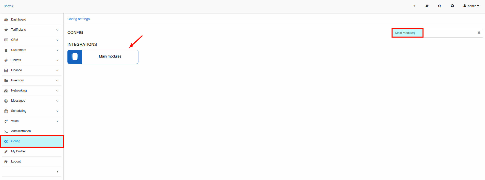

and enable a button for **TR-069(ACS)**:

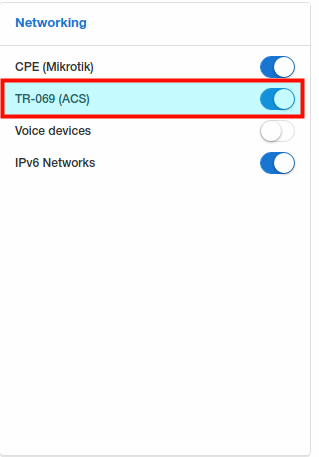

Once this enabled you will see a new sector under left side menu under topic *Networking*:


Let's start configuring the ACS server:

##### Step 1

Navigate to **Config/Networking/TR-069(ACS)** and specify global parameters:


Here we have next options:

* **Enable ACS services** - enable/disable ACS services. Can be used for reboot of ACS server;

* **SSL enabled by default** - enable/disable using of domain name except of IP for access. Enable only if HTTPS/SSL enabled under *Config / Main / HTTPS/SSL*;

* **Allowed networks** - List of allowed networks for connecting to cwmp service. To allow all host use 'all' value;

* **Username** - using for authorization to connect to cwmp service. ATTENTION - authorization enabled only if username and password is not empty;

* **Password** - using for authorization to connect to cwmp service. ATTENTION - authorization enabled only if username and password is not empty;

* **Hostname** - hostname without protocol and port(*192.168.105.80* or *mysplynx.com* depending on your configuration);

* **Periodic inform inverval(seconds)** - interval on how often Splynx will sync with an ACS.

Don't forget to click on "Save" button.

##### Step 2

On the same menu **Config/Networking/TR-069(ACS)** let's configure ACS User Interface parameters:

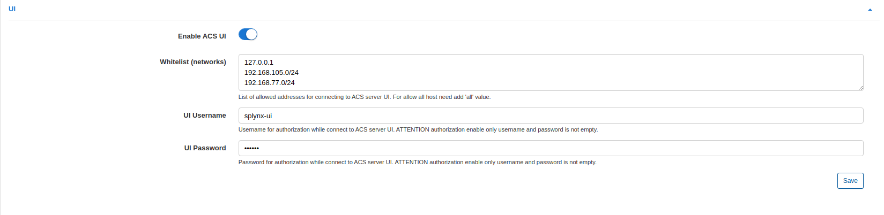

* **Enable ACS UI** - enable/disable an access via web interface;

* **Allowed networks** - specify allowed networks from which you can access to the ACS UI;

* **UI username** - username for UI access;

* **UI password** - password for UI access.

Don't forget to click on "Save" button.

##### Step 3

Click on a link for UI here:


And you should be redirected to the Genie ACS page, if you prompted for login/password use a login/password from a previous step.

After successful login you will see this window where you should click on "ABRACADABRA" button.

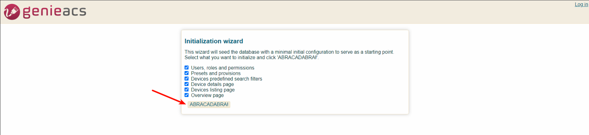

Once this done, you will see GenieACS dashboard:

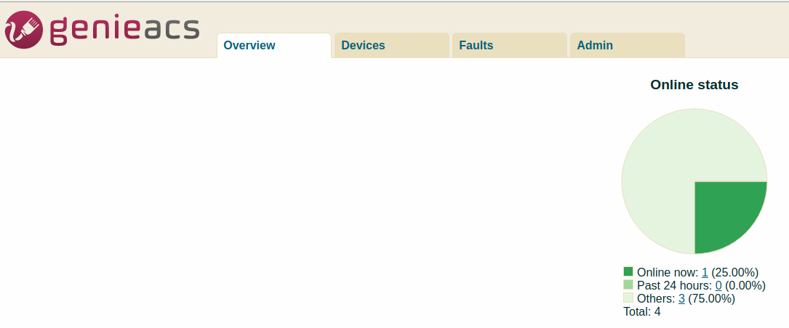

Main parameters for ACS are configured, you can use this feature now. Also we have a few more options to configure: Attributes, Types and Groups.

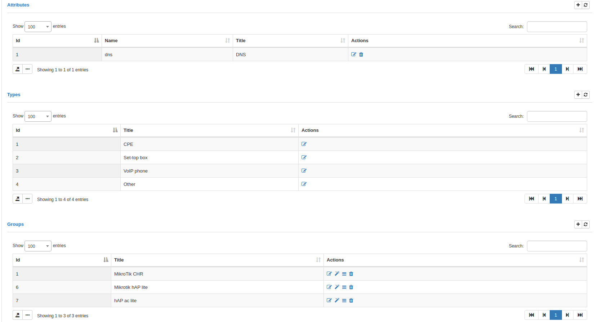

##### Attributes:

Here can be added some custom attributes to be displayed under ACS devices in Splynx. For example we need to display a DNS attribute on the main info of device:


##### Types:

Simply add different types of devices:


##### Groups:

Under groups you can create new entries to group devices.

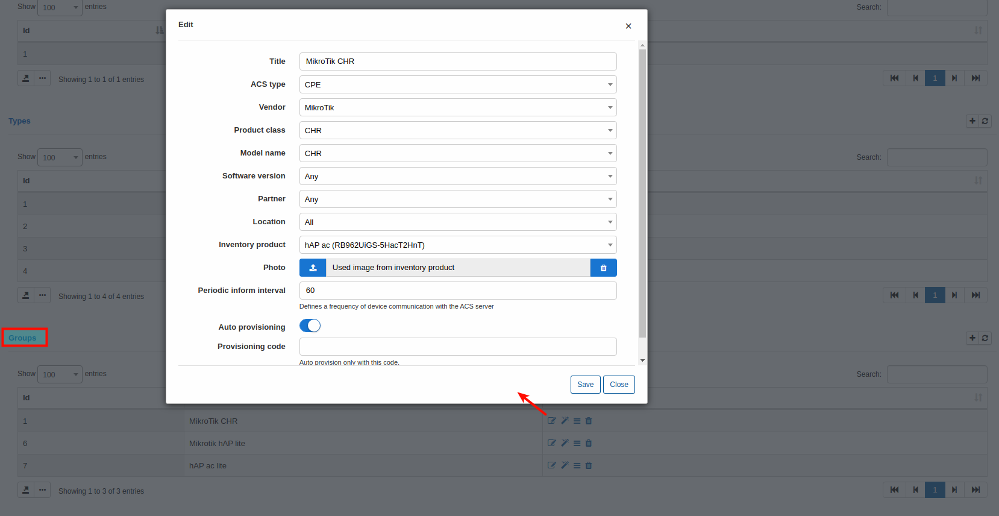

Here can be selected next parameters and inventory product code(if existed), selected photo of device etc. If "Auto provisioning" enabled you can use next tool:


Need to be described.

Also you can view recently added custom attributes here:

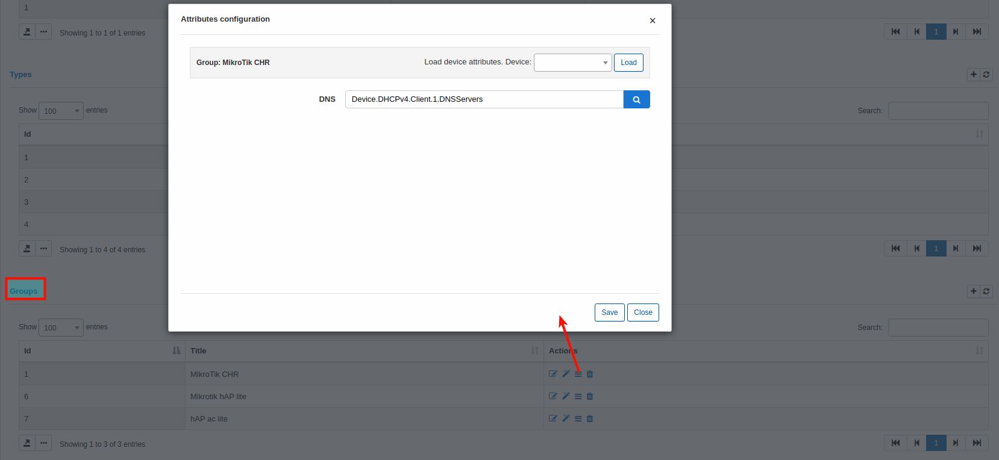

Need to be described.

### Connect the device

Let's add some TR-069 client. We will use Mikrotik as an example. First of all, under Mikrotik must be installed TR-069 package. If package is not installed use next steps to install it:

1. Open Winbox and connect to the router;

2. Update router to latest stable version *System > Packages > Check for updates* and update if needed;

3. Navigate to Mikrotik Downloads and download the package for your device;

4. Extract the downloaded archive and find tr069-client-X.XX.npk;

5. Upload tr069-client-X.XX.npk into your device and reboot device (System > Reboot);

6. After reboot you should see a TR-069 option in menu:


Click on this button and configure connection to the ACS:

1. Enable client;

2. ACS URL is a URL from menu on step 3 for a CWMP(ends with port 7547);

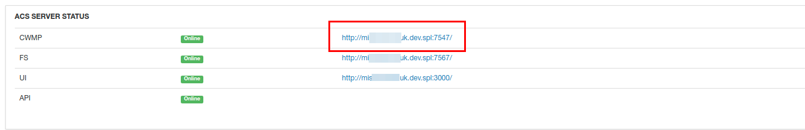

If you noticed we are using here another URL - it's because we changed a hostname from IP 192.168.105.80 to a domain name.

3. Specify username and password with values from global parameters(Step 1);

4. Enable "Periodic Inform Enabled".

That's all. After that you should see next:

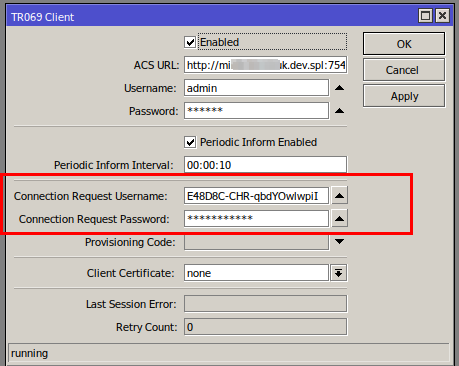

Should appear "Connection Request Username" and "Connection Request Password" - do not change these parameters(only when you need to reconnect this device with an ACS, these values can be removed and re-enable client - with new connection you will see new values).

**NOTE** that if you are using HTTPS/SSL on your Splynx server you can get an error about SSL, asking for the local certificate. In this case you need to run 2 commands in Mikrotik terminal:

```
/tool fetch https://letsencrypt.org/certs/trustid-x3-root.pem.txt
/certificate import file-name=trustid-x3-root.pem.txt passphrase=""
```
and do not change any other config in TR-069 client("Client certificate" option must be "none"), just re-enable TR-069 client.

After that device will be registered under GenieACS:

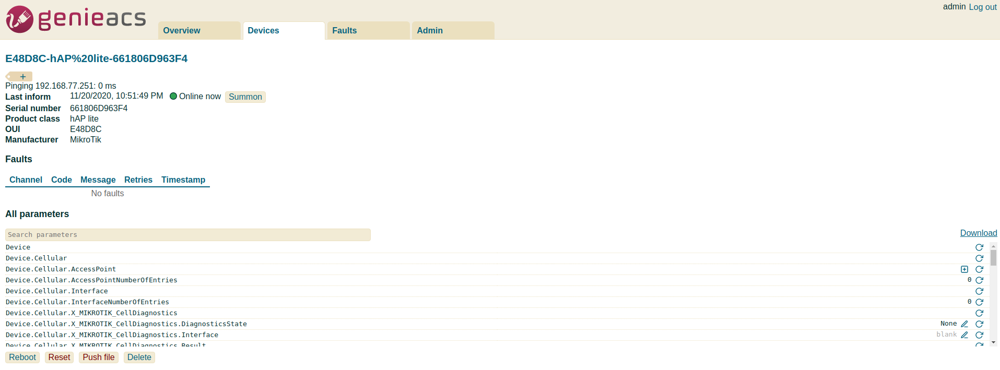

as well under Splynx:

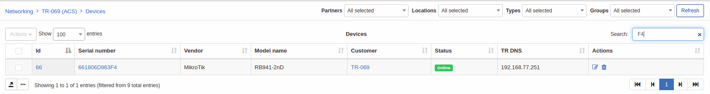

Devices can be in statuses: Online, Online today, Offline.

Let's see on device control menu:


On the **Overview** tab you can see basic parameters like uptime, IP. CPU usage etc.

On the **Relation** tab you can set type of device(type should be created under Config/Networking/TR-069/Types) , group(should be created as well) also the customer and their services can be linked to this device.

On **Tasks** tab you will see pending tasks(like you run a wi-fi password change and task will be created).

On **Faults** tab you will see tasks what were executed with errors.

When click on **Actions** button you can find next options:

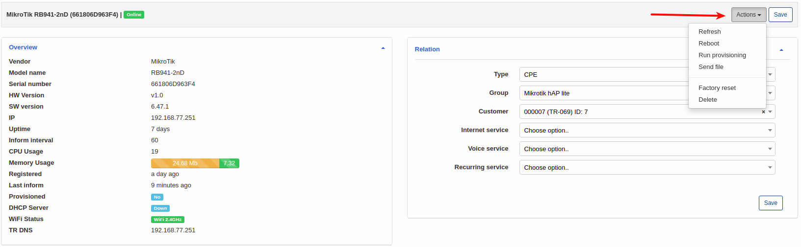

- *Refresh* - you can use it to refresh device connection between ACS and Splynx;
- *Reboot* - remotely reboot a device;
- *Run provisioning* - run provisioning for a device;
- *Send file* - send some file to a device;
- *Factory reset* - reset to factory settings;
- *Delete* - delete this device from the ACS.

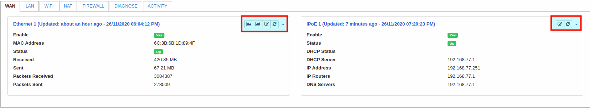

This view can change depends on device what you are using. This screenshot was made from Mikrotik device. Switch between available tabs to configure needed parameters.

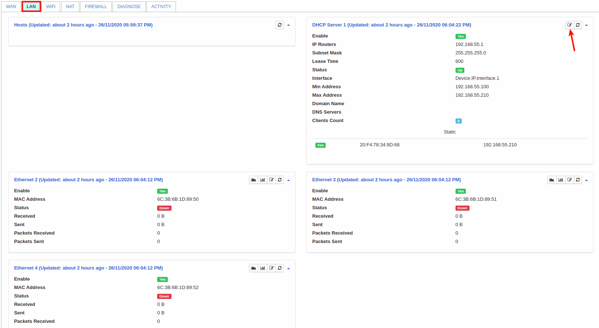

As an example we can change a DHCP server parameters:

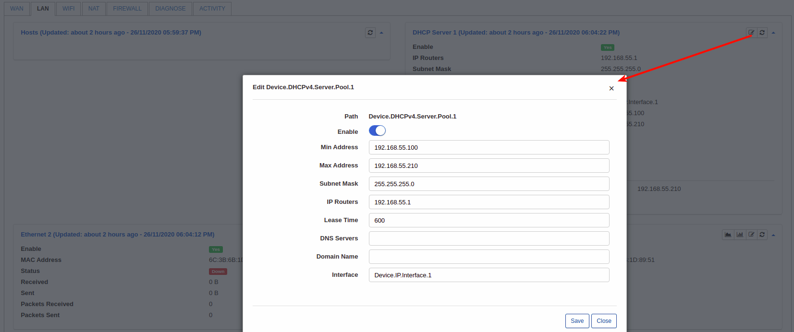

or add some firewall rules right here:


Debug logs can be found under **Administration / Logs / Files** and find files by word "genie":


