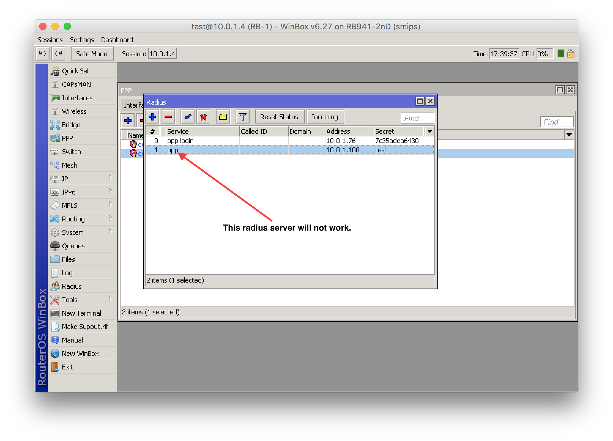
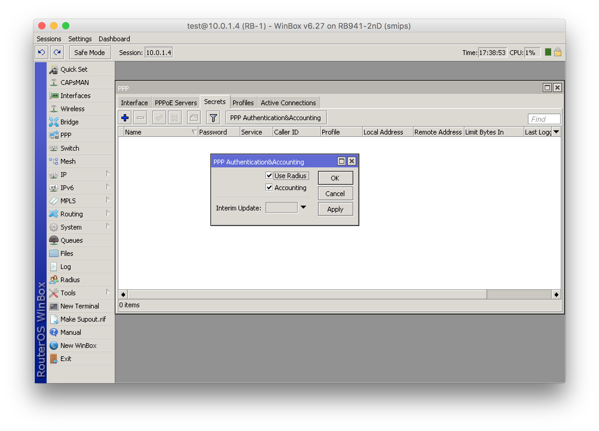
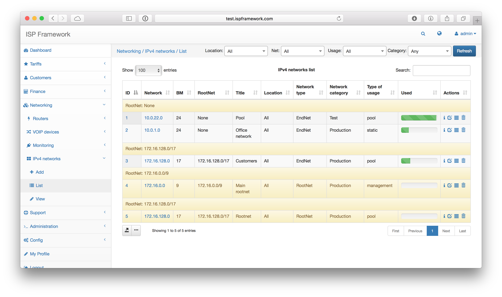
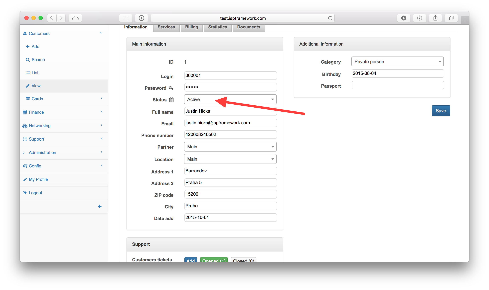
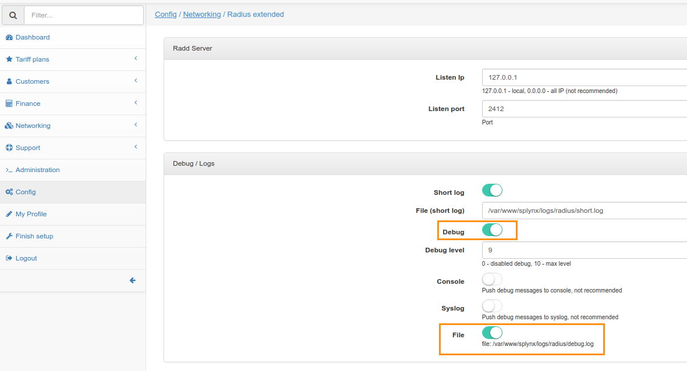
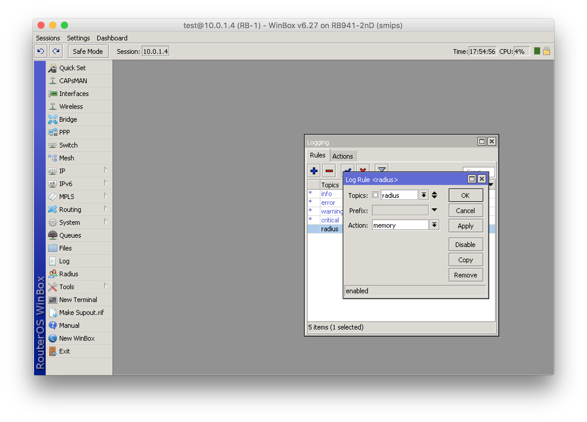

Troubleshooting Radius server
==========

This is a post showing how to troubleshoot communication between router (Mikrotik example) and Radius.

Video tutorial for Radius configuration can be found here – https://splynx.com/384/ispframework-and-radius-mikrotik-example/.

Below are steps for Radius and Splynx configuration:


### Mikrotik Radius section
To configure Mikrotik router and Radius authentication we should change the settings in Mikrotik Radius section.
1. Choose services that have to be authenticated by Radius (ppp, DHCP, login etc.)
2. Enter IP address = Splynx IP address, reachable from Mikrotik
3. Secret = this value is located at `Splynx -> Router -> Edit -> Radius secret`

  

4. We cannot use more than one Radius server per Service

  


### MikroTik PPP (in case if PPPoE is used)
1. Enable on Secrets -> PPP Authentication & Accounting features “Use radius (yes), Accounting (yes)”



2. Set Profile – default or default-encrypted, set Local address (it’s IP of Mikrotik router for establishing PPP connections)


### MikroTik DHCP

If we use IPoE authentication (DHCP), we should enable Radius communication on DHCP server.


### MikroTik Hotspot
For enabling Radius hotspot authentication please change the Hotspot configuration of Mikrotik under IP -> Hotspot as shown below:


When we enable services for Radius authentication, we can move forward and configure router in Splynx.


### Splynx router configuration

`Splynx -> Networking -> Routers`, here you can edit or change router settings. Important fields to fill are:
1. Radius Secret should be the same as in Mikrotik settings
2. IP/Host –  the real IP (or host, or dyndns host) from which Mikrotik sends packets. In case when NAT is between Mikrotik and Splynx Radius, host IP will be public IP of NAT router and real IP will be private IP of Mikrotik router.
3. Authorization/Accounting – please, set DHCP/PPP/HotSpot Radius. Even if you choose PPP, DHCP and Hotspot authentication will work as well. The difference is in DHCP Radius, here you can find accounting API. It means that for getting statistics from DHCP server, Splynx should connect to API of Mikrotik. This is caused by unsupported Radius accounting packets on Mikrotik routers.
4. NAS IP – IP address of router (on radius packet – NAS-IP-Address), in case when you use hostname of router you need to set this IP (you can set this IP on Mikrotik  – Radius – Src. Address)


### Define IP networks for IP assignments

`Splynx -> Networking -> IPv4 networks`
Add some network for dynamic assignment (pool) or permanent (static) usage




### Activate customer and set the Internet service

When we have added router and networks to Splynx, it’s the right time to add a customer and activate him




Then, we need to create an Internet service for the customer with PPP details (or MAC in case of DHCP authentication), IP address and other details.


If all these steps were made and Mikrotik router still shows Radius timeout in log, we need to do a quick troubleshooting.


### Troubleshooting

First of all, check the file in Splynx logs called `radius/short.log`. It can be found in `/var/www/splynx/logs/radius` or in web interface section `Splynx -> Administration -> Logs -> Files`.

In this file you can find records like these:
```
28/02 14:54:16:7361 - [Login               ] - [10.2.32.109    ] - Accept
28/02 14:54:23:3637 - [C38F676DB15B        ] - [10.2.36.0      ] - Log in
28/02 14:54:18:6727 - [C38F676DB15B        ] - [10.2.33.190    ] - Log off -  (NAS-Error)
28/02 14:54:19:3702 - [26117AB65E2B        ] - [10.2.36.0      ] - Log off -  (Session-Timeout)
28/02 14:54:22:7030 - [-Unknown-           ] - [10.250.74.24   ] - Reject (ATTR + IP accept) - [26117AB65E2B] -> [service1] Customer not found
28/02 14:54:23:2525 - [26117AB65E2B        ] - [10.2.33.190    ] - Reject (Attribute accept) - [FCACAF943B30] -> [service1] Customer is not active
28/02 14:54:14:2384 - [user                ] - [10.2.36.247    ] - Reject - [B4FBE4ACFCC2] -> [service1] Customer is already online
28/02 14:54:21:2743 - [265798031           ] - [               ] - [card] Accept
28/02 14:54:21:5017 - [265798031           ] - [10.5.28.211    ] - [card] Log in
28/02 15:10:35:6518 - [voucher-login       ] - [10.1.0.202     ] - [card] Log off -  (User-Request)
28/02 15:11:05:2315 - [serieALRClM4sj      ] - [               ] - Reject card - [4FFE0CD555D3] -> [hap-liter] Password is incorrect
```
Meanings:
* **Accept** - Splynx server received Radius Access Request packet from Router and Radius Access Accept was sent back. Customer was authenticated.
\* Please note, if MS-CHAP is used for authentication, we can see `Accept` here even if password is incorrect.
* **Log in** - Splynx server received Radius Accounting Start packet from Router.
* **Log off** - Splynx server received Radius Accounting Stop packet from Router.
* **Reject** - Splynx server received Radius Access Request packet from Router and Radius Access Reject was sent back. Customer was not authenticated.
* **Reject (Attribute accept)** - Splynx server sent Radius Access Accept packet to Router with IP address from Splynx service. Customer was authenticated on the router with session time limit = *Config / Networking / Radius / Error session time limit*. IP address was added into Address list `Reject_x` on the router.
* **Reject (ATTR + IP accept)** - Splynx server sent Radius Access Accept packet to Router with IP address from Splynx Reject pool (*Config / Networking / Radius / Reject IP x*). Customer was authenticated on the router with session time limit = *Config / Networking / Radius / Error session time limit*. IP address was added into Address list `Reject_x` on the router.
* **\[card\] Accept** - The same as **Accept** but for Prepaid vouchers.
* **\[card\] Log in** - The same as **Log in** but for Prepaid vouchers.
* **\[card\] Log off** - The same as **Log out** but for Prepaid vouchers.
* **Reject card** - The same as **Reject** but for Prepaid vouchers.

In case of authentication errors or logging off, the reason can be shown.

---

If `radius/short.log` is empty or gives not enough information, Radius server should be set to debug mode.

Splynx Radius server consist of 2 daemons – splynx_radd and freeradius. Both of them have different debugging and show different information. Let’s start with splynx_radd debugging:

To enable debug mode of splynx_radd, go to *Config / Networking / Radius extended* and enable debug into file:



Then wait few minutes until new settings will be applied. Or you can apply new settings immediately if you restart Radius server.
To restart Radius server use a button at the bottom of the same page (*Config / Networking / Radius extended*), or enter command in SSH:
```
service splynx_radd restart
```

Now we can check the debug file, again it’s accessible from CLI of Linux Splynx server:
`/var/www/splynx/logs/radius/debug.log` 
The best way to check the file is command
```
tail -f /var/www/splynx/logs/radius/debug.log
```

If splynx_radd debug doesn’t show us anything, we can try to run freeradius daemon in debug mode and see if any packets are received by Radius server.

Run CLI commands:
```
service freeradius stop; freeradius -Xxxx
```
and check the CLI console output.


If you don’t see any debug messages when customer tries to connect to Mikrotik Router, it means that your router cannot send packets and connect to Radius server at all. It means that you have to verify networking, routing and NAT settings of the network.

On Mikrotik Router there is also availability to run extended debug to see what exactly router is sending to Radius server:


