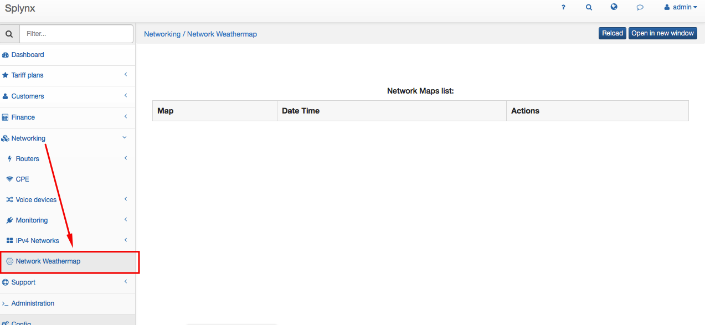
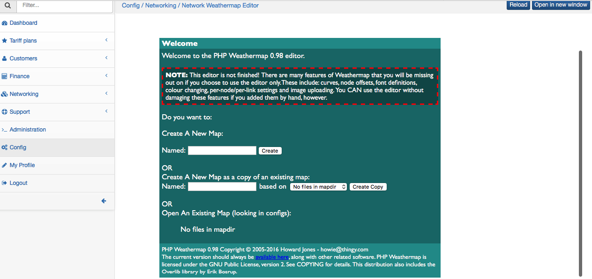
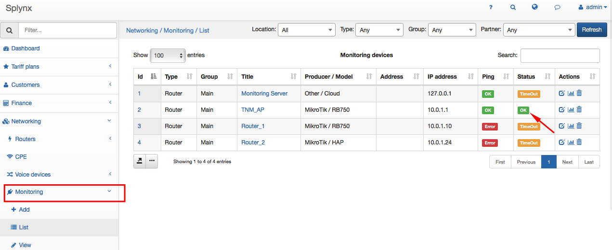
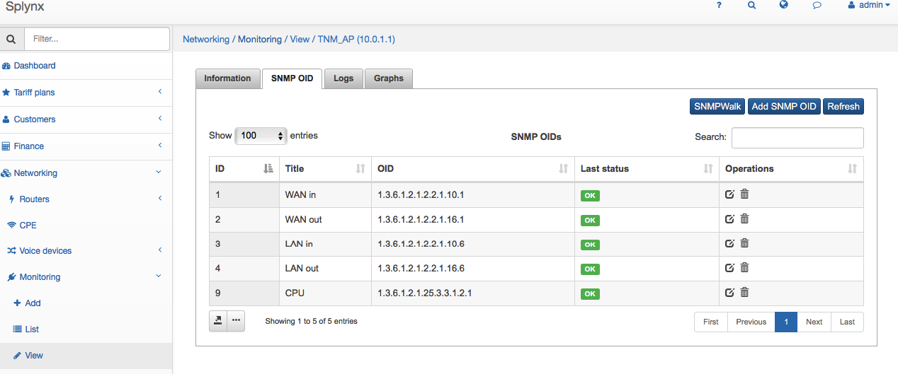
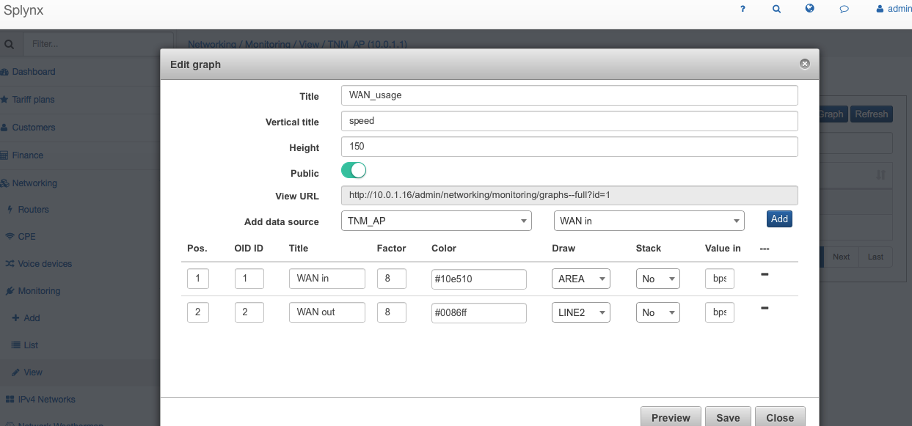
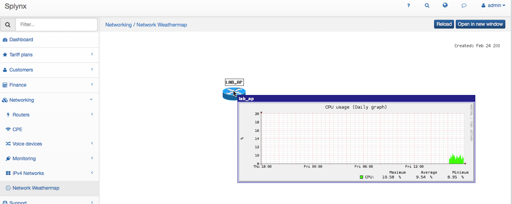
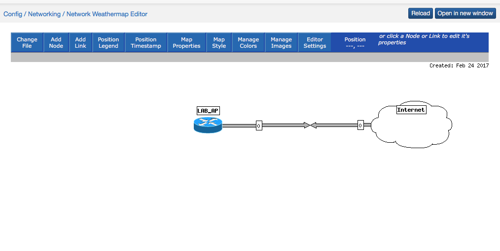
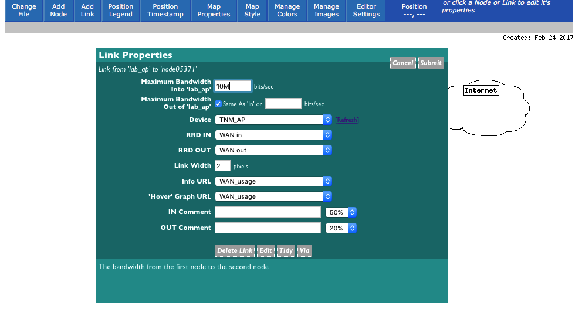
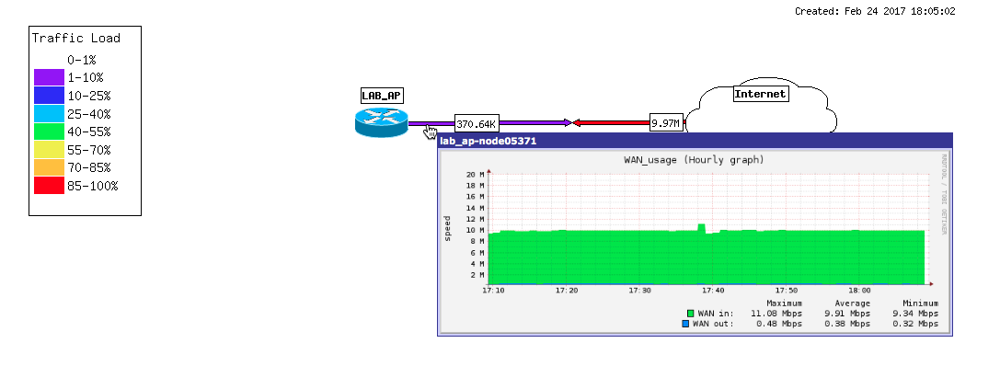
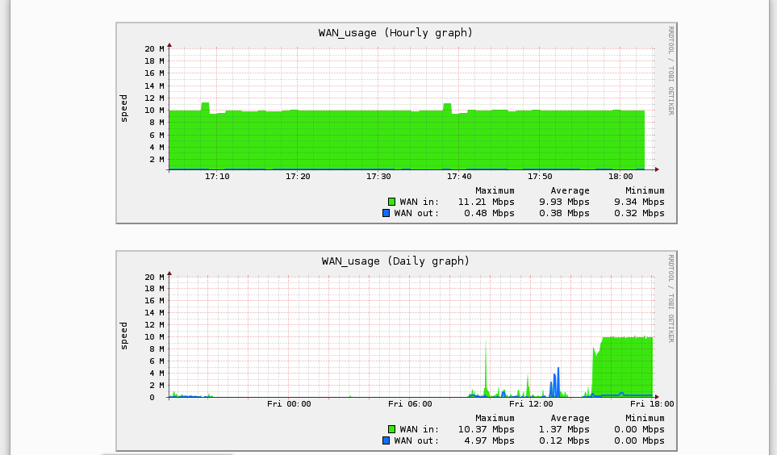

Weathermaps
==========

To install network weathermaps run commands:
```
apt update
apt install splynx-network-weathermap
```

After successful installation in `Splynx → Networking`, Network Weathermap menu will appear.


We integrated awesome open source tool https://network-weathermap.com to Splynx, it's installed as a module and connected via API to our platform.




To create a new map open editor tool in Splynx `Config → Networking → Network Weathermap`.




Choose the name for new MAP and create it. First map LAB was created and it's empty now.


Let's add a device. Weathermaps work with equipment which is added to `Networking → Monitoring`. So, to get some visualisation of the network we need to add devices to Monitoring and configure their SNMP OIDs for interface traffic, CPU and similar.



Device is added to Monitoring, now let's add SNMP OID values and configure charting in Splynx:






When all devices are properly configured in Monitoring, we can add them to Weathermap. All configuration in editor is very simple and straightforward: use drag and drop and place the routers ona  map, connect the links.


You can choose there device from Splynx monitoring list, define what will be shown as a main chart for device and assign a picture for element on the map




When the router is added, we can add second device and configure link between our two devices. I've added a device "Internet" and will configure the link WAN, OIDs of this link I have on my LAB_AP router.




We don't have to look for OID. Just choose the OID from link, and setup the chart you want to display as hover chart of the link and the main chart which will show the complete usage of the link on a separate page.




It's ready, let's go back from configuration mode to the view mode and check if the new picture was generated (please note that the topology map is generated every 5 minutes).


The legend shows that traffic loads, and here on example we can see that Download in LAB router is using almost all of 10 Mbps available.

Charts are available in hover mode, topology can also be open in a new window (shows the last hour usage on link):




If we click on the link, new window will open with historical charts, showing usage per week, month and year:


