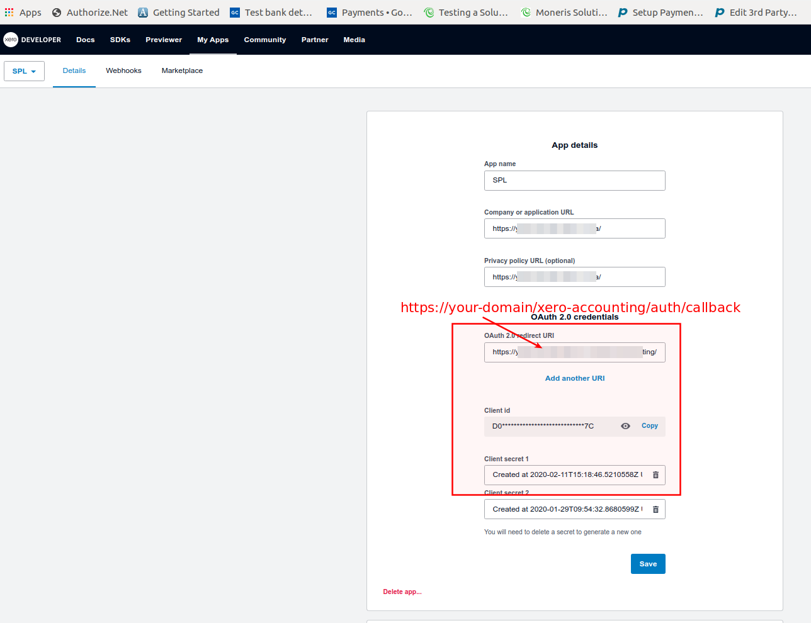
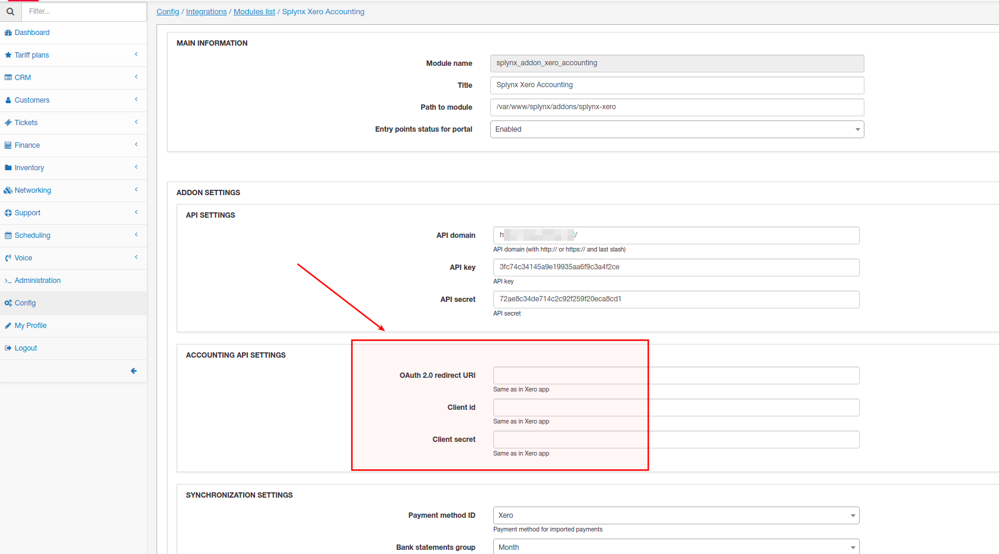
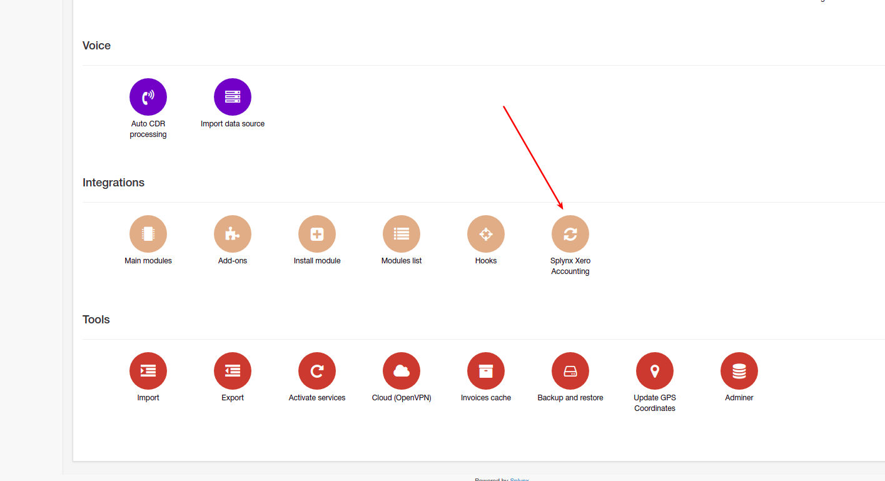
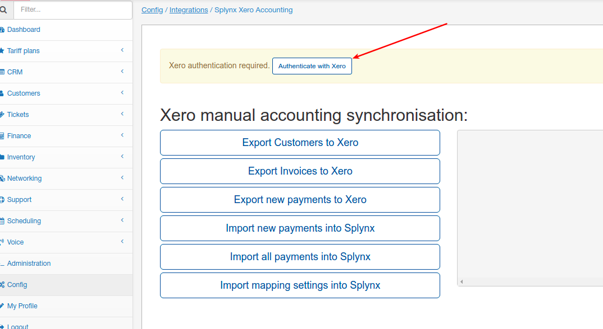
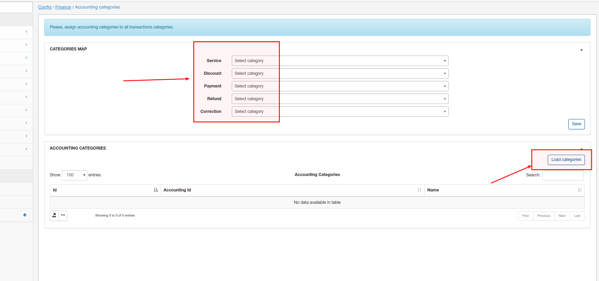

Xero accounting
====================

**We have developed an addon for Xero within Splynx. It’s used for synchronization of accounting actions between Xero and Splynx**

Step 1: You should create Xero app here - https://app.xero.com/Application/

Step 2: Once app is created, you have to add credentials from Xero to Splynx under Config/Integrations/Modules list - splynx_xero_accounting:

Step 3: Navigate to Config/Integrations/Splynx Xero Accounting, authenticate and check connection between Splynx and Xero:

Step 4: Configure accounting categories, bank accounts, taxes. Navigate to Config/Finance/Accounting categories, click on "Load categories" and selecte loaded categories to Categories Map.

Configure  bank accounts(Config/Finance/Accounting bank accounts) and taxes(Config/Finance/Accounting taxes) using the same example.
