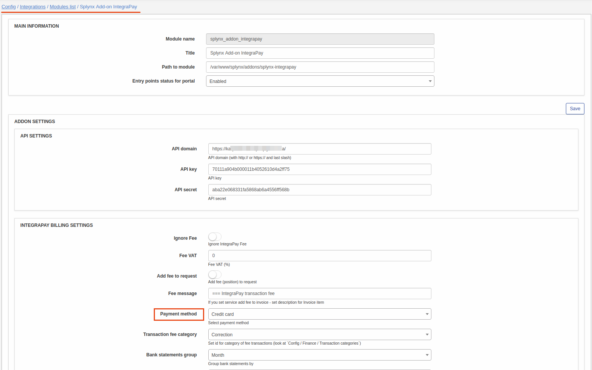
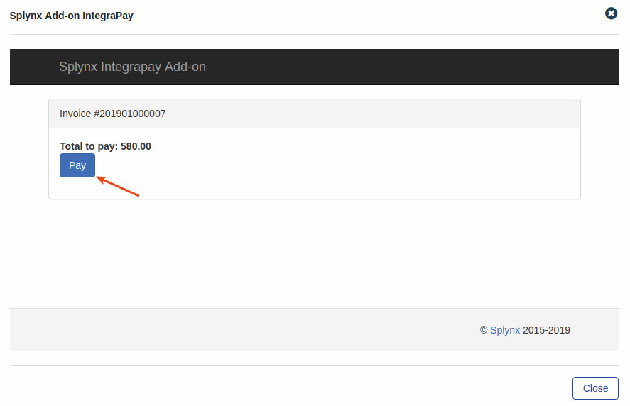
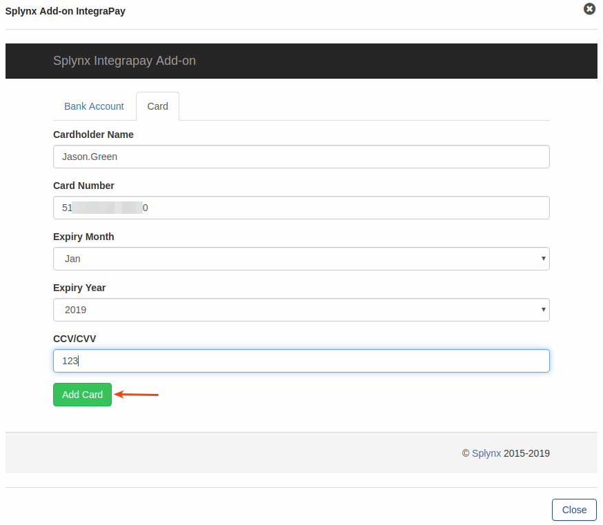
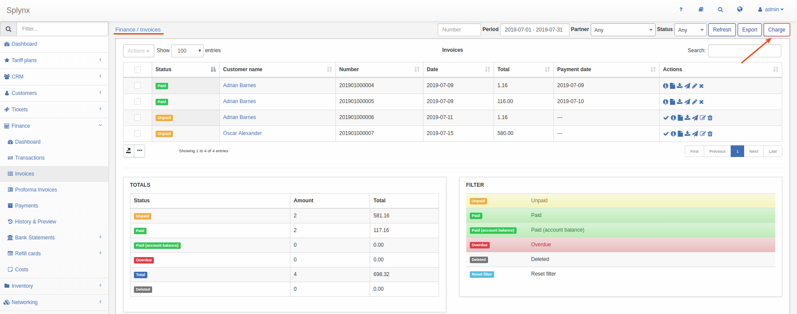
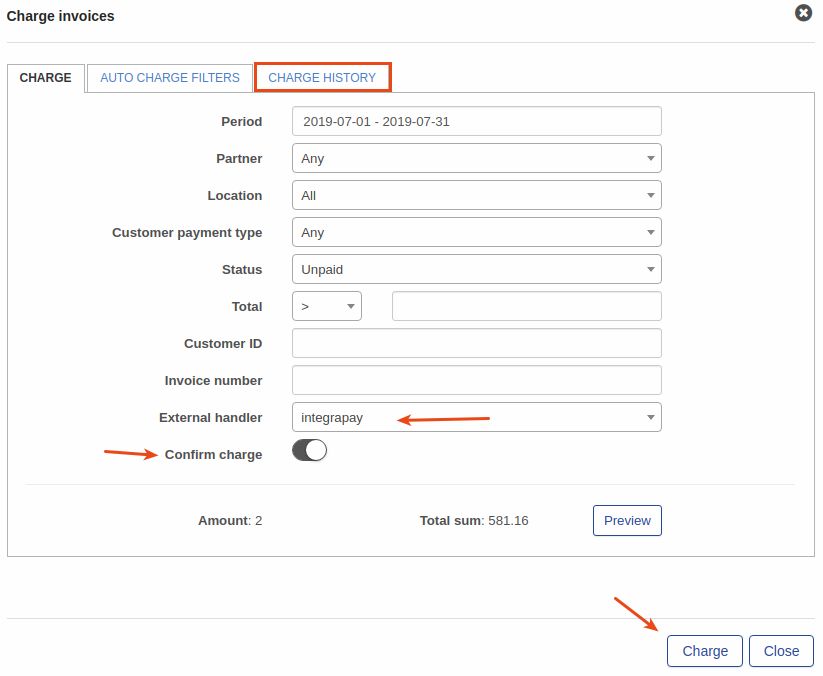

**Integrapay**
============

**Integrapay** is a Splynx add-on. It uses to synchronize customers, invoices and payments with  payment software - https://www.integrapay.com.au/ Customers using Integrapay can pay your invoices through banks or you can charge your customers bank accounts by debit orders.

To install Splynx-Integrapay add-on, use following commands:

```
apt-get update
apt-get install splynx-integrapay
```
or you can install it from Web UI:

*Config → Integrations → Add-ons:*


Then first step - you should to register in https://www.integrapay.com.au/.  After registration IntegraPay will sand you email with your credentials, where  _**Bussines ID** it's your **Username** and  **Api User Key** it's your **password**_ :


After that you need to set your User name, Business ID and Password in Splynx *Config → integration → modules list → splynx_addon_integrapay*:





After that you configure Add-on customers will see new pay button near their invoices and new item of finance menu:


Customer have to go to the *Finance → Pay via IntegraPay direct debit* and set his Bank Account or Credit Card (depends on what he will use to pay for invoices) or press a button "Pay with IntegraPay" and configure account here:




Bank account settings, or press tab "Card" to set up payments with card:



Also customers can to refill their balance by *Finance → Pay via IntegraPay direct debit*:


Besides, you can charge all customers, using one button! Go to *Finance → Invoices*, set the period and click "Charge" as at the screenshot:





"Charge history" tab contains all charges history you made, sometimes it is very helpful when there are some finance issues.
