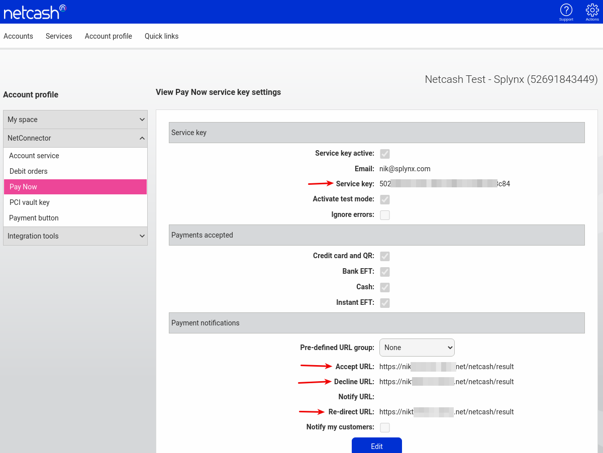

Netcash
====================

Using Netcash addon customers can pay their invoices in few clicks from portal.

To install an addon navigate to **Config → Integrations → Add-ons**


find "splynx-netcash" record and click on install button:


or from terminal:

```bash
apt update
apt install splynx-netcash
```

After installation an addon has to be configured, to do this navigate to **Config → Integrations → Modules list**


"Service key" field must be filled with your PayNow service key:



Under "Payment notifications" section you have to configure Accept URL, Decline URL and Re-direct URL with value of next format: **https://yourSplynx.com/netcash/result**.


All the rest parameters can not to be changed or you can configure here additional service fee(if needed) and other common settings.

After configuration entry points(widgets for portal) should be enabled:


Here can be enabled/disabled entry points(widgets) for customer's portal to pay their invoices.

We enabled 2 entry points and they are available from customer's portal:

On dashboard:


And under Finance/Invoices:


Also we have a widget for prepaid customers to add some amount of money directrly from portal. To enable it navigate to addon's entry points menu and find this widget:


and you will see it under customer's portal:


Netcash logs can be found under **Administration → Logs → Netcash logs**


As you can see on our screenshot we have also Netcash debit order logs because we have installed this addon as well. Use only selected on a screenshot log entry for Netcash addon.
