Netcash Debit Order(former SagePay direct debit)
====================

**Netcash Debit Order is a Splynx add-on(previously SagePay direct debit) . It used to customers be able to pay their invoices by https://netcash.co.za/**

Install the add-on with commands from terminal:

```
apt update
apt install splynx-netcash-debit-order
```

or you can install it from Web UI:

**Config → Integrations → Add-ons:**

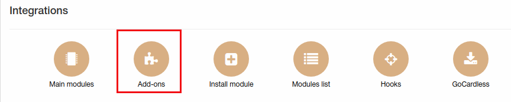

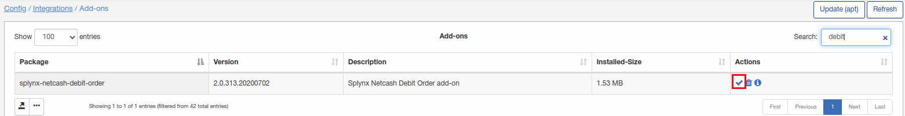


**After that you need to registrate on [Netcash portal](https://netcash.co.za/) and configure your account.**

After registration you will use these values in Splynx Netcash debit order addon configuration:

Account service key:
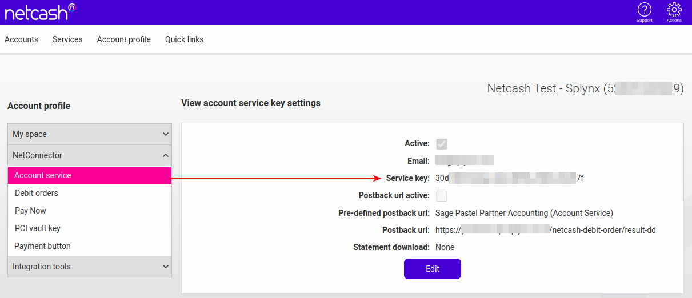

Debit orders service key:
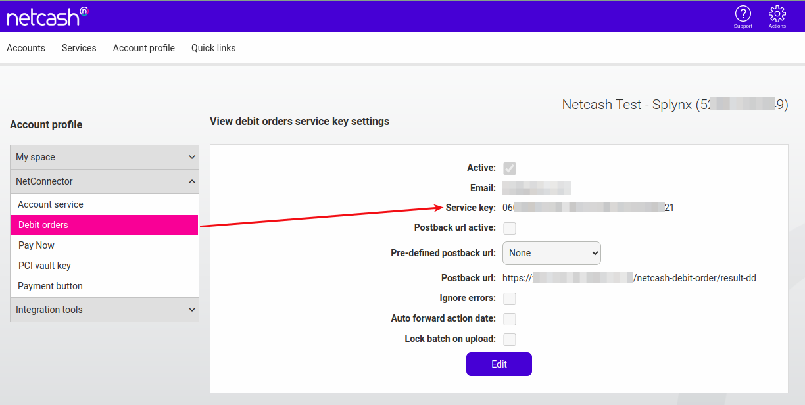

PCI vault key:
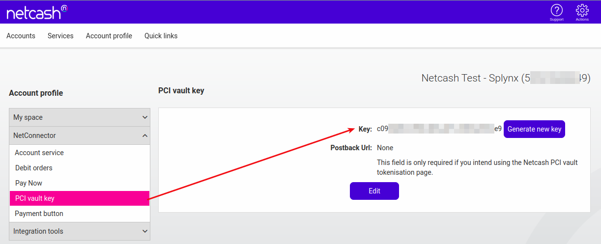

And merchant account number.


These values have to be placed under **Config → Integrations → Modules list -> Netcash** :
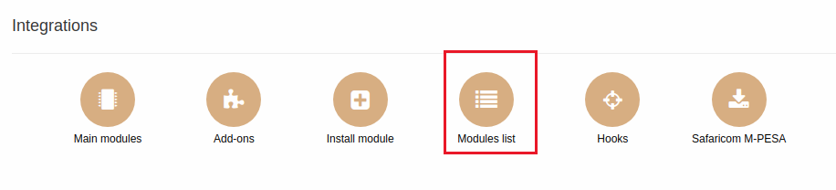

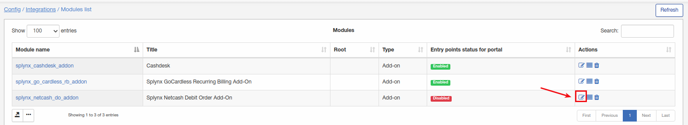

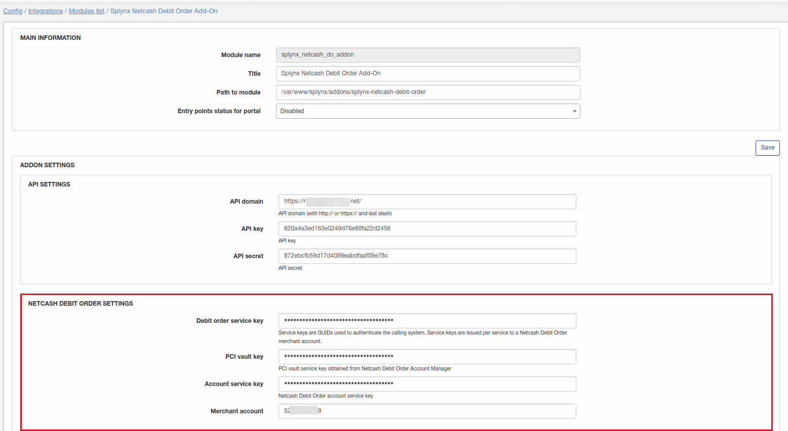
****Service key - this key need only when customers use their own credit cards to pay.****
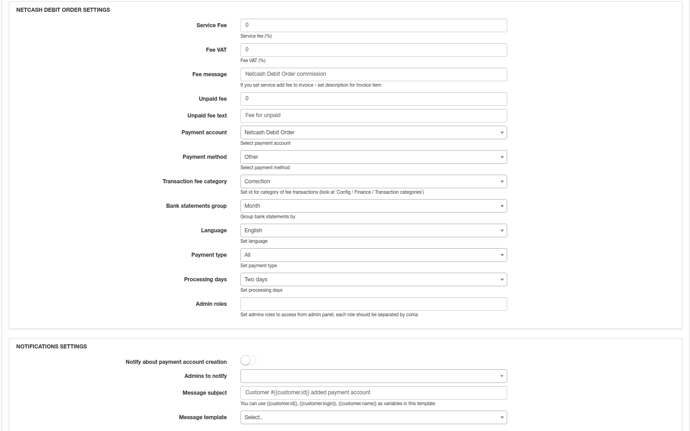

You can also set fee for customers and set admins roles to access from admin panel.
Also admins can be notified when customer created Netcash payment account - to enable it use "Notifications settings".

To add Netcash payment account navigate to customer's "Billing" tab and click on + on Payment accounts window:

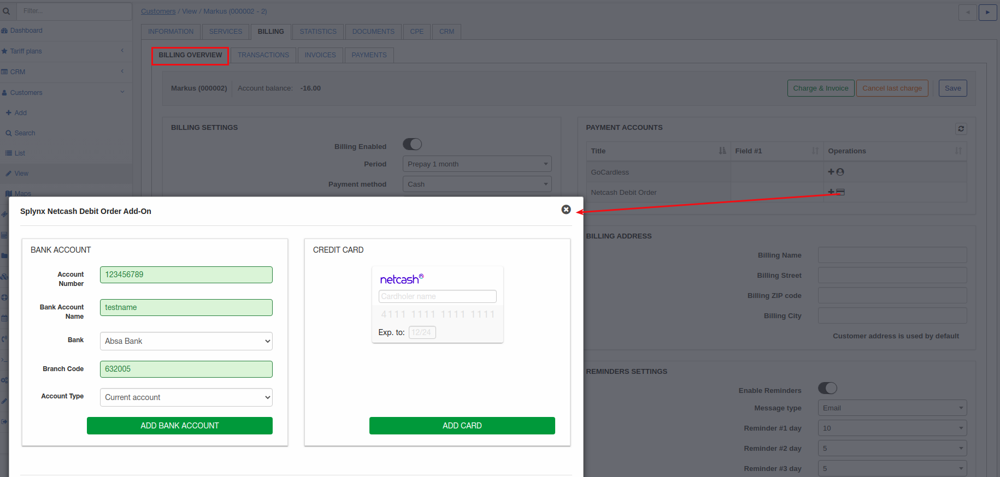

here admin can add Netcash payment account for customer with given bank account details or directly add credit card details.

When customers have Netcash payment account admin can charge their invoices all at one time.

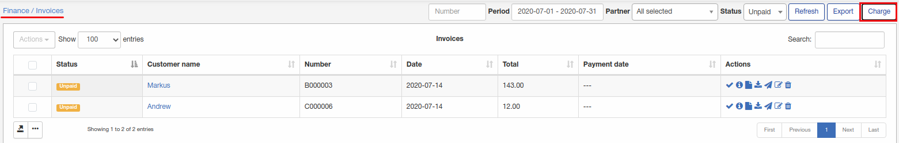

Invoices can be charged by full invoice amount or by customer balance:


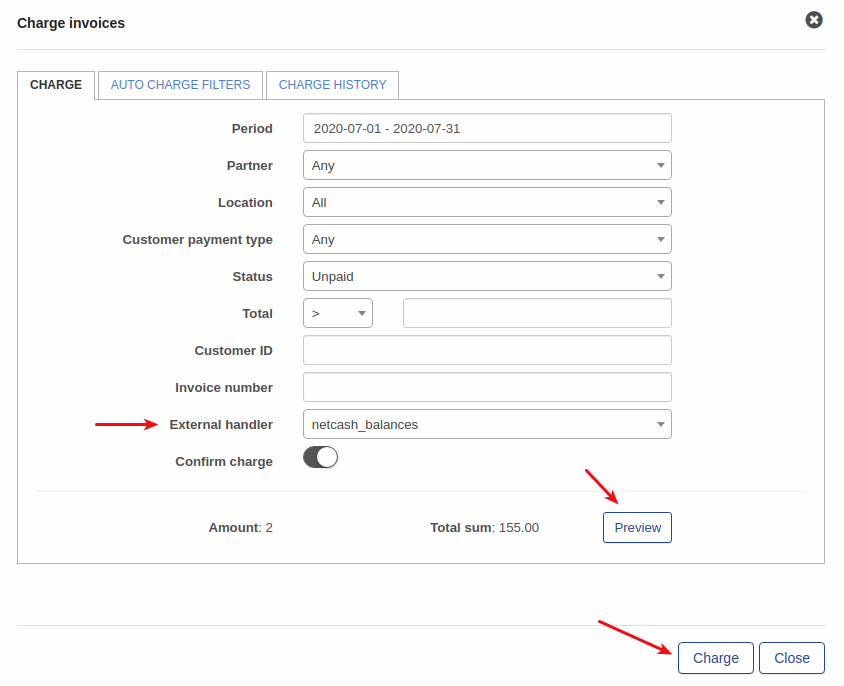


After that splynx will create and send debit batch file with payment details to the [*https://netcash.co.za/*](https://netcash.co.za/) after what Netcash procces this file.

Then Splynx send a request once per day to Netcash by ****cron**** and Netcash will return you payment status what you can view Payments status by *“Netcash debit order check payments”* in the *finance* menu:

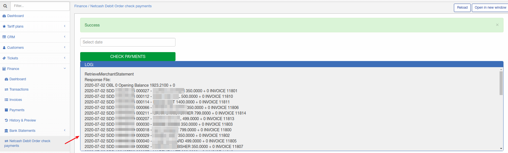

Charge history can be checked under "Charge history" tab:

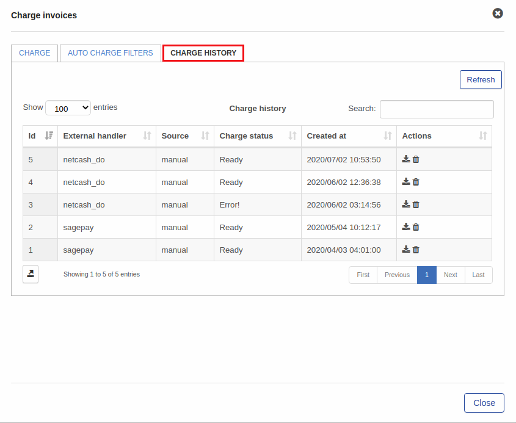

File with charged invoices can be downloaded or removed.

Also process of invoice charge can be automated. To achieve this admin should add "Auto charge filter":

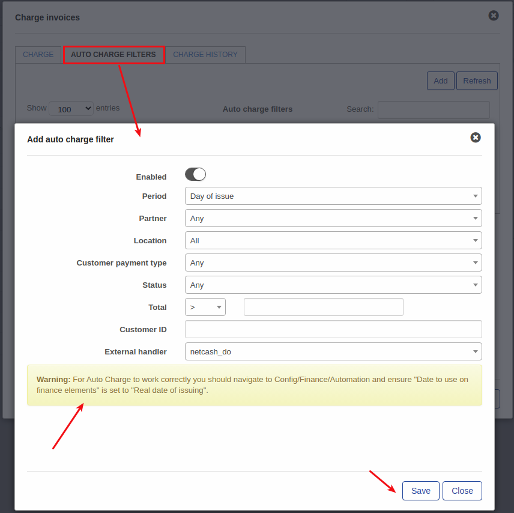

Be attentive when create this filter to avoid problems with future charges.

### Customer portal widgets(entry points)

After installation Netcash Debit order, customers can be allowed to pay their invoices directly from portal page using widgets.

First of all widgets(entry points) must be enabled in config:


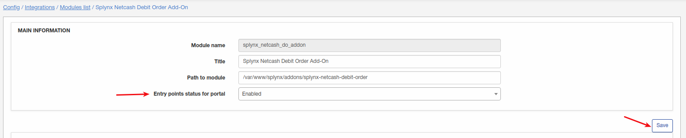

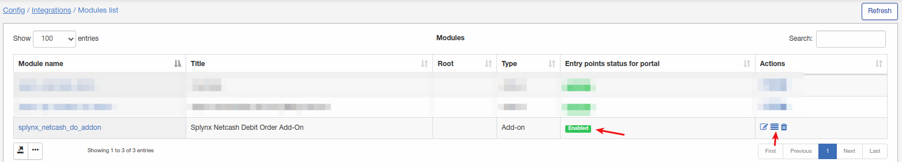

Here widgets can be enabled/disabled and updated by partner value, location value to make this widget available only for specific partner or location.

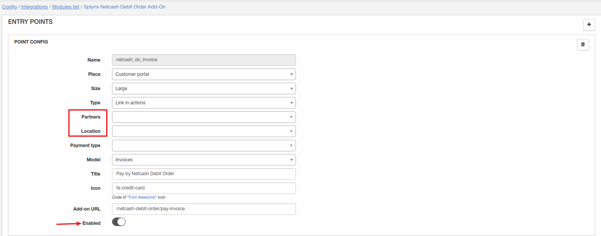

Once it's enabled let's navigate to customer portal:

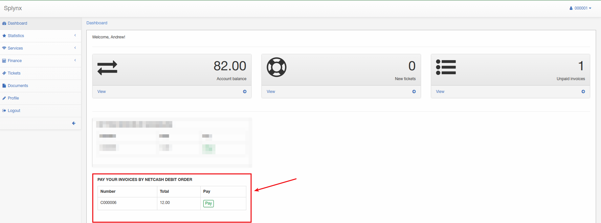

First entry point what is enabled on customer's portal is on a screenshot and customer can pay an invoice using it.

Another entry point on customer portal is under **Finance -> Invoices**:

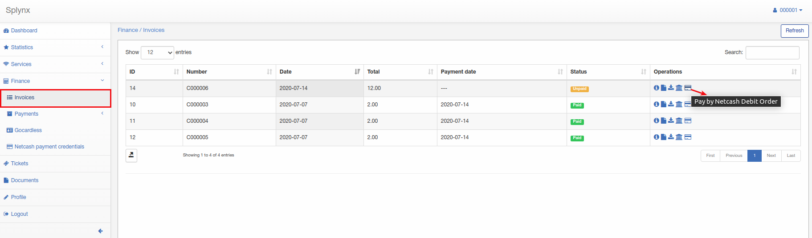

Also customer can check, update or remove Netcash payment credentials here:

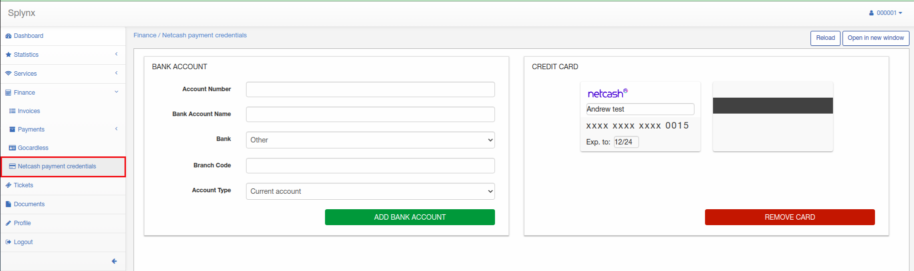

**Note** if customer will pay his/her invoice using Netcash Debit Order from portal using widgets - new separate bank statement will be created under admin portal on Finance-Bank statements - History.

### Admin page widgets and log files

Netcash logs can be found under **Administration/Logs**:


Under general logs can be found different records like when statement was created, when payments were processed etc:

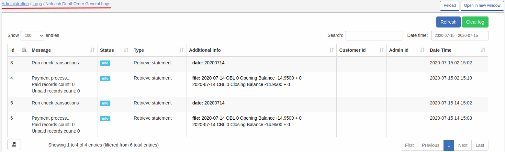

and under charge logs only logs regarding charges can be found:

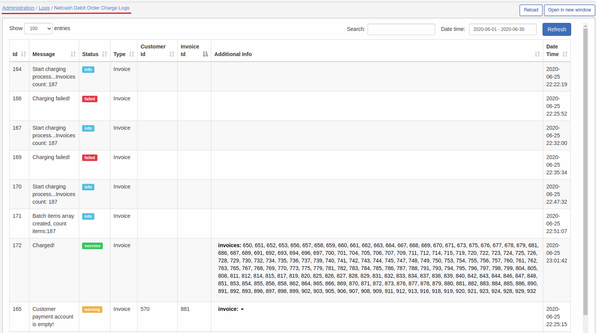

Also we have one useful widget when needed to import mass amount of Netcash payment accounts for customers. If you have a csv file with customer identifier(name or ID exactly like in Splynx) it can be easily done using this tool under **Config -> Tools**:

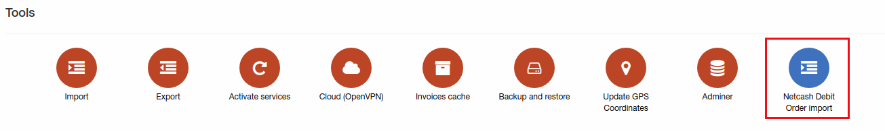

Here csv file can be uploaded, selected delimiter and click on "Upload":

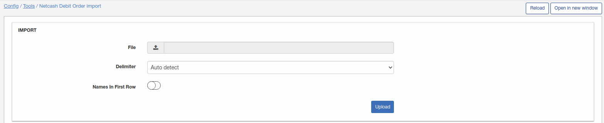

When file is uploaded select corresponded header for each column in your file:

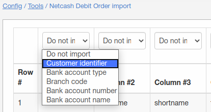

File must contains: customer identifier(ID, name), bank account type, branch code, bank account number and bank account name.
