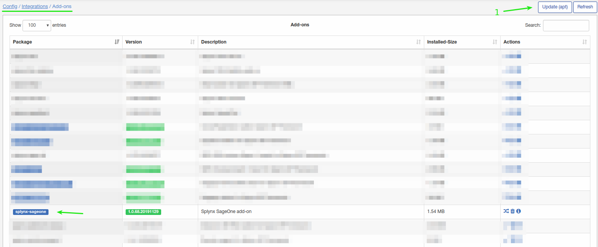
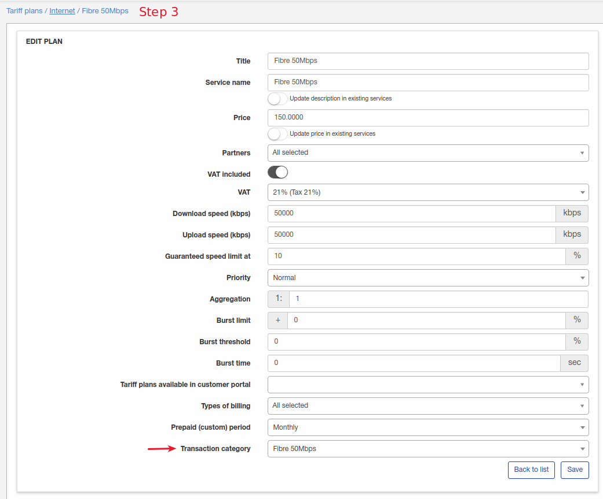
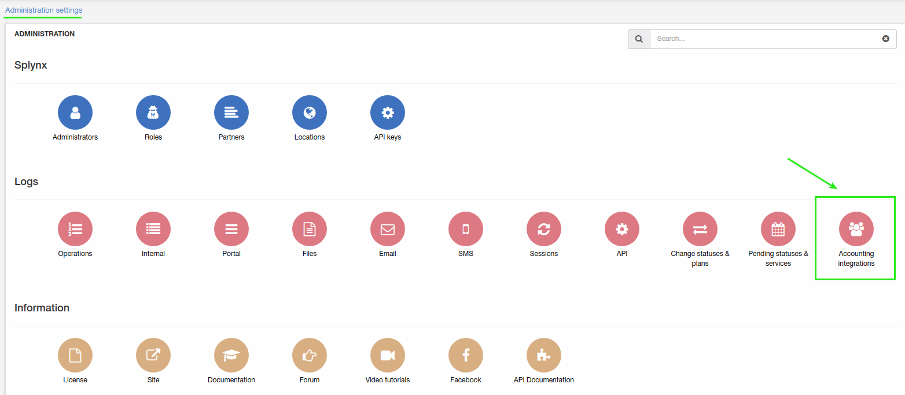
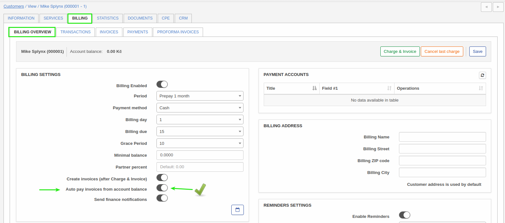
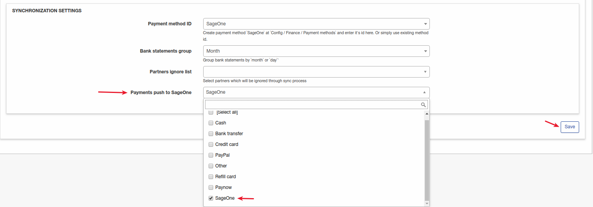

SageOne
====================

**We have developed an addon for SageOne within Splynx. It’s used for synchronization of accounting actions between SageOne and Splynx**

**The integration is described here: https://www.youtube.com/watch?v=ctuNzm_qWgs**

*SageOne does NOT allow the charging of customers.*

Install the add-on with commands:

```bash
apt update
apt install splynx-sageone
```

or you can install it from Web UI:

**Config → Integrations → Add-ons:**


Click on "Update(apt)" button first and then install SageOne. On this example the add-on already installed.

**For the Splynx-SageOne integration, you need to create a new SageOne account and configure your account accordingly.**

**We recommend to starting with a fresh SageOne account, if you have existing customer data, we will not be able to match customers in SageOne with customers in Splynx.**

Once you have created a new SageOne account navigate to **Config → Integrations → Modules list** and click the "Edit" button on *splynx_addon_sageone_accounting*:


Enter your account details:


Here you have to specify your SageOne account login and password. "Company ID" will be loaded automatically if left empty, however, if you know your Company ID please insert it.

**Configure and map your accounting categories and bank accounts**

For categories-configuration navigate to **Config → Finance → Accounting categories**


Click on "Load categories" to sync categories from SageOne to Splynx. On this screenshot, we only have 4 categories. For services, we selected the "internet services" category, and for the rest - the "Extra" category. Don't forget to save the configuration.

Category configuration depends on your SageOne account items. If you have created item for each tariff (1 tariff in Splynx = 1 item in Sage) you would configure the categories as per the guide below:


Item for tariff Fibre 50Mbps - synced.


Next, we need to create a transaction category in Finance→Transaction categories for this item and select the option "same as service or tariff" and save the configuration.


Enable the option below to access the transaction category option in the specified tariff.


In the internet tariff config, select the transaction category which you created in Finance→Transaction categories.

This way you can map all tariff plans which you have created as items in SageOne.

For **payment synchronization** you must configure bank accounts:

For bank accounts configuration navigate to **Config → Finance → Accounting bank accounts**

In this example, we have 2 bank accounts and we will use #2 "Bank Payment" as the default account and specify it for the SageOne payment method.


**Once the add-on is configured we can start working with SageOne.**

Navigate to **Config → Integrations → Splynx Sageone Accounting** and sync your customers to SageOne.


In this example we have 3 customers and by clicking **Export customers to SageOne** we will synchronize our customers to the SageOne account.


You can log in to your SageOne account to ensure that customers were synchronized:


You can also view SageOne synchronization logs in **Administration → Logs → Accounting integrations**:

Here you can view statuses of all synchronized customers, payments and invoices.


As you can see on the *Customers* tab there are 3 entries for 3 synced customers. Every synchronized customer, invoice and payment will have an "Accounting ID". If this value is empty - the item wasn't synchronized with SageOne. In this case, you can run a manual synchronization or wait until the next scheduled synchronization. In this view you can see a warning about transaction categories configuration because it was captured before we mapped the categories in *Config → Finance → Accounting categories*

Once customers are synchronized, we can create an invoice and push it to SageOne.

As you can see from the screenshot, the invoice was synchronized.

In the logs, you can view all synchronized invoices:


In SageOne we can also view this UNPAID invoice.

Once the invoice is PAID, Splynx will import the new payment automatically (bank account must be configured for payments synchronization).


Alternatively, you can manually sync payments here:


**NOTE! To mark the invoice status as "paid" we have to enable the following option after payment synchronization - "Allow pay invoices from account balance" must be enabled under the customer’s billing tab.**


You can also view logs of synced payments:


We can also view the invoice status which will now reflect as “Paid”:


The transaction was also created:


As well as the payment:


Payments created in Splynx will be synced with SageOne every 24 hours.
To check time of synchronization run this command:
***cat /var/www/splynx/addons/splynx-sageone/config/config.ini.php***
and find this line **"cron_launch_time"**


**Some examples of errors which could occur:**

*Scenario 1*

An invoice was synchronized, deleted in Splynx (for example invoice was incorrect and you have deleted it and create a new one with the same number) and you are attempting to sync invoices to SageOne:


**Fix:** Remove the invoice from within the SageOne account or if you are unable to remove it from SageOne re-create the invoice in Splynx with a new invoice number.

*Scenario 2*

When trying export payments from Splynx to SageOne getting this error:


```
Export payment: 2020-02-00644
Skip by payment method!
Export payment: 2020-02-00645
Skip by payment method!
```
**Fix:**  in SageOne add-on config set up appropriate for you payment method for payments export:

