Auto processing
==========

The Voice auto CDR processing is managed here. We can import a CDR's to charge the customer and print the register of calls in his invoice.

The process is similar to [Voice -> Processing -> CDR import](../processing/processing.md), but here we can import many CDR's together automatically.

Firstly, to import CDR's you need to go to the **Config -> Voice -> Import data source** and add CRD's location.

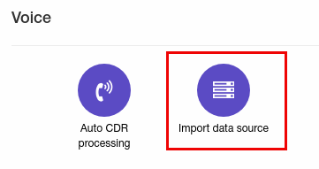

Add FTP data source:
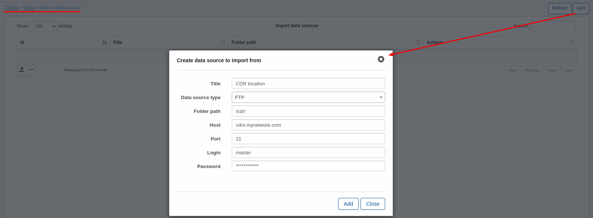

Or add local data source:
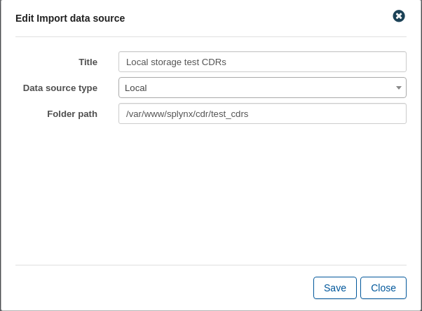

We will use local storage as an example.

Here you need to set:

  * **Title** - any name;

  * **Data source type** - select type from drop-down menu:

    * SFTP - if you select "SFTP" then you will need to enter RSA private key. CDR files are located on a FTP server;

    * FTP - if you select "FTP" then you will need to set the same parameters as for "SFTP" but without RSA key. CDR files are located on a FTP server;

    * Local - if you select "Local" then you will need to set only Title and Folder path. CDR files are located on a Splynx server;

  * **Folder path** - set your path to folder with CDR files;

  * **Host** - set your host IP address;

  * **Port** - if data source type is FTP or SFTP - specify here port to connect to FTP;

  * **Login** - if data source type is FTP or SFTP - specify here login to connect to FTP;

  * **Password** - if data source type is FTP or SFTP - specify here password to connect to FTP.

Once data source is added, you can test connection(if FTP) or edit data source using these buttons:

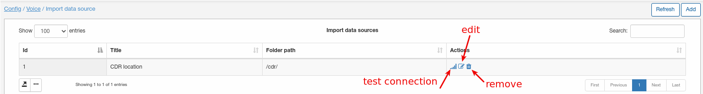

**In case of using FTP server as CDR data source - make sure that connection successful.**

**In case of using local storage(on Splynx server) make sure that folder with files has correct permissions and "splynx" user owner**

We have added local storage of CDRs named "Local storage test CDRs" and we will use it in auto processing configuration.

We will use next format of CDR files(it's very simple format so we can not to use custom handlers to parse files):

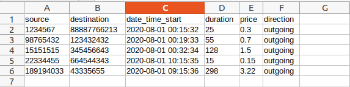

**Very important thing is to have 1 file with calls per 1 day, because Splynx checks name of a file and if file with this name was imported to Splynx, after that file was updated - Splynx won't re-load this updated file as file with this name was already imported.**

Now, when data source is added, you need to go to the **Config -> Voice -> Auto CDR processing** and add auto processing unit:

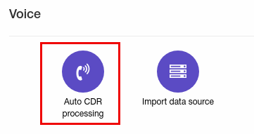

Let's create auto processing entry by click on "Add" button:

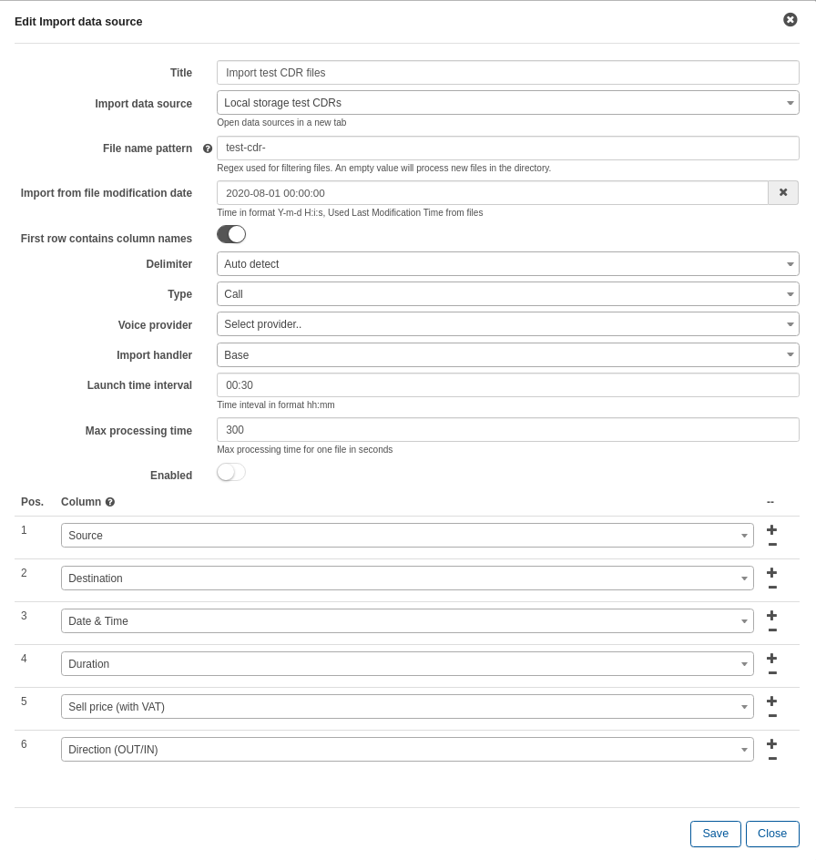

Here we specified:

  * **Title** - any name;

  * **Import data source** - select data source from the drop-down menu(in our case local storage);

  * **File name pattern** - Regex for filtering file names (uses pcre syntax):
    Will process all the files that have pattern entrances in a file name. [Examples](voice/auto_cdr_processing/examples/examples.md). We have all CDR file names starts with "test-cdr"(eg. test-cdr-2020-08-01.csv);

  * **Import from file modification date** - specify file modification date for import. In our example to import only files for August 2020 we specified 2020-08-01 00:00:00, but if file with calls for July was created at on 2020-08-01 00:00:01 it will be also imported;

  * **First row contains column names** - turn it on if the first row in your CDR's contains columns names;

  * **Delimiter** - select a delimeter from drop-down menu;

  * **Type** - select from drop-down menu type of data what you would import. In our case it's only calls;

  * **Voice provider** - select needed voice provider;

  * **Import handler** - select your handler from the drop-down menu;

  * **Launch time interval** - How often an auto processing will be running;

  * **Max processing time** - max time what Splynx will spend to process one file. If processing of file takes more that specified value - it will be ignored;

  * **Enable** - In case it is on, an auto processing will be running every 'Launch time' interval, and if disabled - you will have to run it manually;

As we have strict and simple format of files we have specified columns regarding to our file format. If you are using handler - columns configuration can be ignored.

After that Auto CDR processing is added, you can run it manually,  from **Config -> Voice -> Auto CDR processing** and press "Run import" button. Before running import we recommend to check files preview what will be imported:

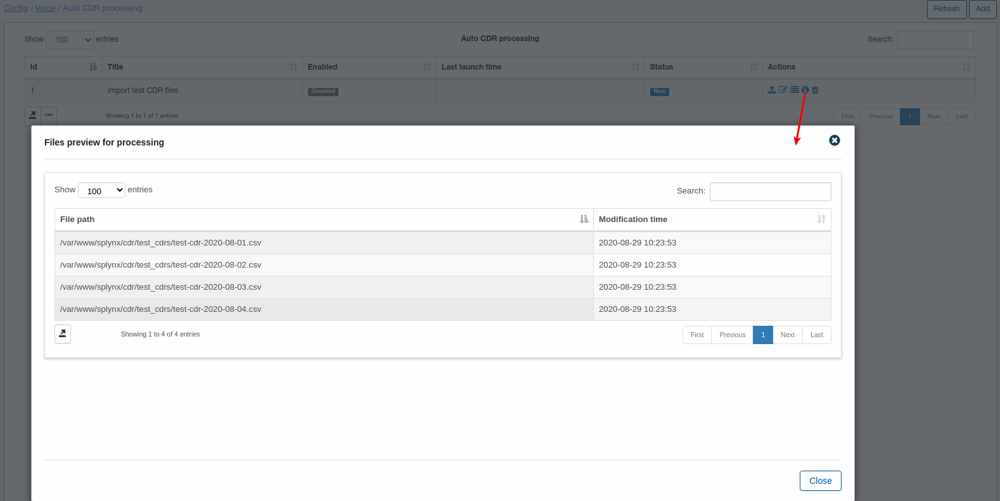

We have 4 files for import and all is correct so we can start import:

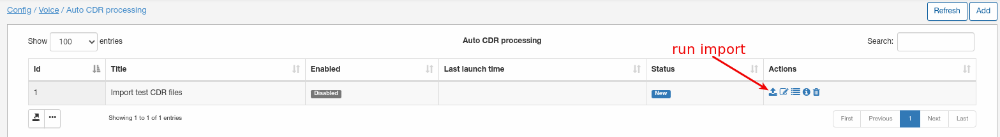

After import we can check results by click on "History" button:

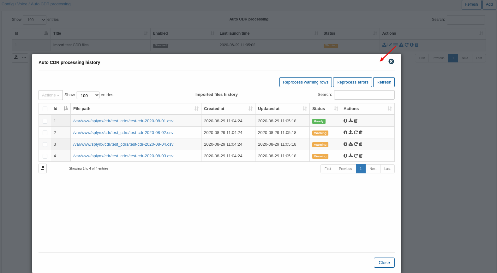

In our case first file was fully processed and all the rest with warnings. Place a mouse cursor on "Warning" message under each file to see number of processed/unprocessed rows:

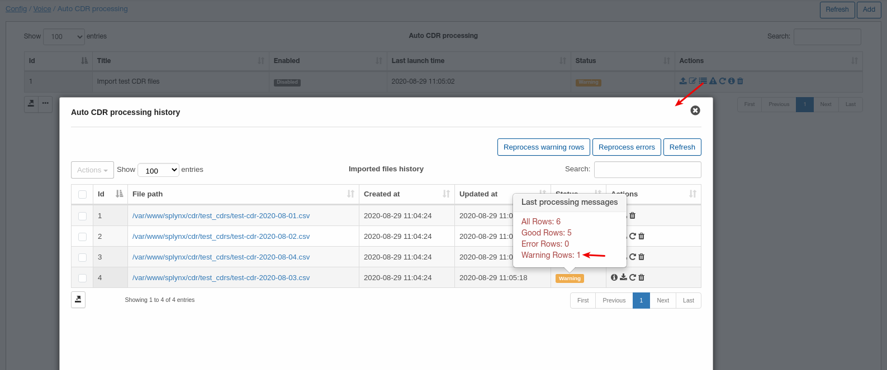

We can click on "Show warning rows" button to find our more information about warnings:

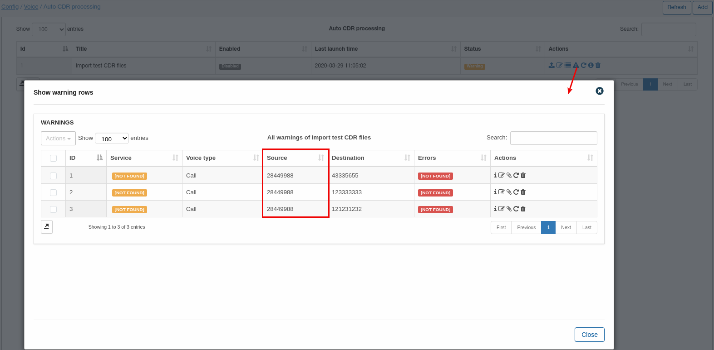

As we can see some calls can't be placed to correct service with source number = 28449988. To fix it we have added voice service for a customer with number = 28449988 and direction = outgoing. Let's reprocess warnings:

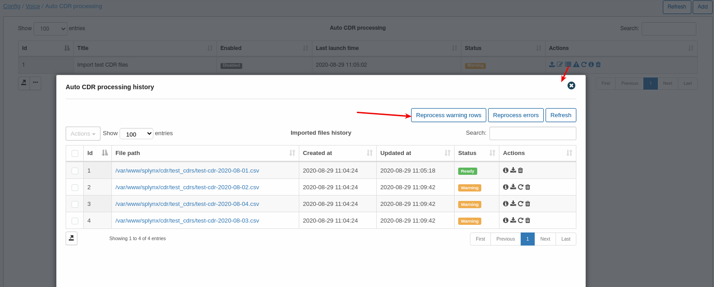

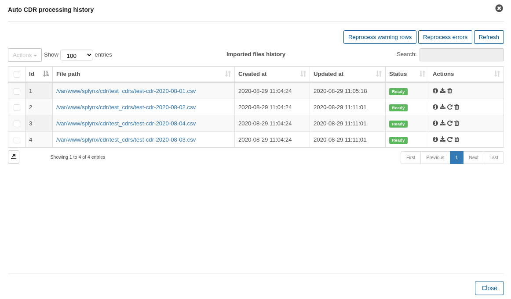

Now after reprocessing we have all successfully imported files. Now i can enable auto processing to grab new files from data source once a day so Splynx automatically grab and import files with calls:

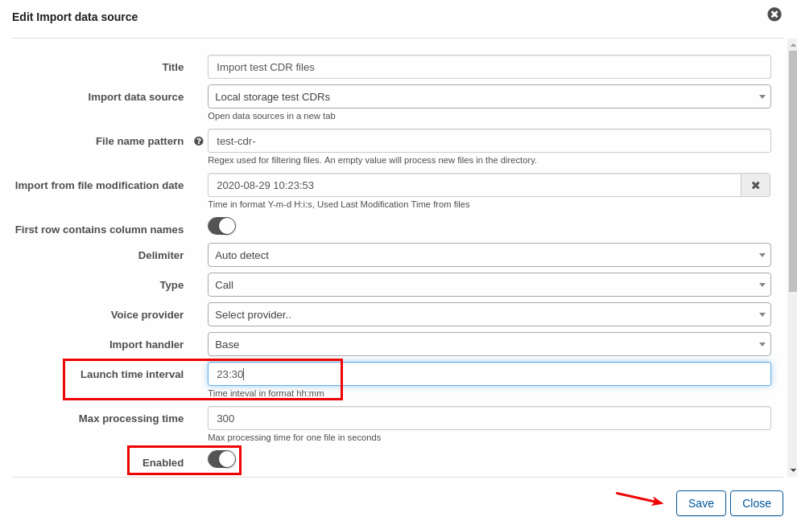
